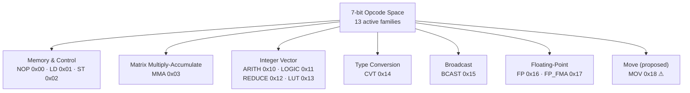
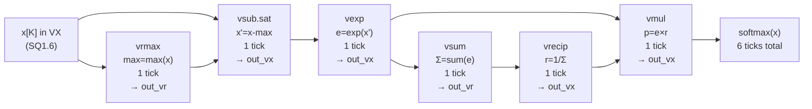
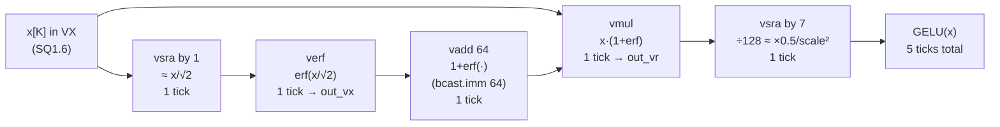

# Instruction Set Architecture

This NPU targets edge SoC integration, so the ISA is designed to be compact and tile-friendly.
We tile GEMM+activation work across multiple pipeline stages inside the core, inspired by
[OpenTPU](https://arxiv.org/pdf/2308.06767.pdf) and
[systolic tiling literature](https://arxiv.org/pdf/1706.10086.pdf).
The FP32/BF16/BF8 conversion and VALU families enable post-GEMM quantization entirely in
hardware without round-tripping through host memory.

---

## Notation

These three symbols appear throughout all ISA, VALU, register-file, and backend code.
Confusing them is the primary source of errors.

| Symbol | Meaning | Test default | Top default |
|:---:|:---|:---:|:---:|
| **`N`** (spoken: **N(bits)**) | Base lane width in bits. Matches MMALU `nbits`. Always written `N(bits)` in prose. | 8 | 8 |
| **`L`** | Number of base VX registers. Must be divisible by 4 for VE/VR aliasing. | 32 | 32 |
| **`K`** | SIMD lane count per register. Equals MMALU array-side `n` at the backend boundary. | 8 | 64 |

Physical register file total = `L × K × N/8` bytes = 256 B (test) / 2 KiB (top).

---

## Instruction Word Layout

All instructions are **32-bit words**. Three formats are defined.

### R-type — register-register operations

Bit 31 is the MSB. Fields are shown **MSB → LSB** (bit 31 on the left).

wavedrom (
{ reg: [
  { name: "funct7",  bits: 7, attr: "[31:25]" },
  { name: "rs2",     bits: 5, attr: "[24:20]" },
  { name: "rs1",     bits: 5, attr: "[19:15]" },
  { name: "funct3",  bits: 3, attr: "[14:12]" },
  { name: "rd",      bits: 5, attr: "[11:7]"  },
  { name: "opcode",  bits: 7, attr: "[6:0]"   }
], config: { hspace: 700, bits: 32, lanes: 1, fontsize: 13 } }
)

### I-type — register + immediate (e.g. `bcast.imm`, `ld`)

wavedrom (
{ reg: [
  { name: "imm[11:0]", bits: 12, attr: "[31:20]" },
  { name: "rs1",       bits:  5, attr: "[19:15]" },
  { name: "funct3",    bits:  3, attr: "[14:12]" },
  { name: "rd",        bits:  5, attr: "[11:7]"  },
  { name: "opcode",    bits:  7, attr: "[6:0]"   }
], config: { hspace: 700, bits: 32, lanes: 1, fontsize: 13 } }
)

The 12-bit immediate is **sign-extended** to the lane width.

### S-type — three-source FMA (VALU_FP_FMA only)

wavedrom (
{ reg: [
  { name: "rs3",    bits: 5, attr: "[31:27]" },
  { name: "rnd",    bits: 2, attr: "[26:25]" },
  { name: "rs2",    bits: 5, attr: "[24:20]" },
  { name: "rs1",    bits: 5, attr: "[19:15]" },
  { name: "funct3", bits: 3, attr: "[14:12]" },
  { name: "rd",     bits: 5, attr: "[11:7]"  },
  { name: "opcode", bits: 7, attr: "[6:0]"   }
], config: { hspace: 700, bits: 32, lanes: 1, fontsize: 13 } }
)

`rnd` is the rounding mode for this instruction only. `rs3` is the addend for FMA.

### Field definitions

| Field | Bits | Description |
|:---|:---:|:---|
| **`opcode`** | [6:0] | Functional family (7 bits) |
| **`rd`** | [11:7] | Destination register index (5 bits; VE uses [3:0]; VR uses [2:0]) |
| **`funct3`** | [14:12] | Sub-operation within the family (3 bits) |
| **`rs1`** | [19:15] | Source register 1 (5 bits) |
| **`rs2`** | [24:20] | Source register 2 (5 bits) |
| **`funct7`** | [31:25] | Attribute field: width/round/sat/dtype (7 bits) |
| **`imm[11:0]`** | [31:20] | Signed 12-bit immediate (I-type) |
| **`rnd`** | [26:25] | Rounding mode for FMA (S-type) |
| **`rs3`** | [31:27] | Third source register for FMA (S-type) |

### funct7 Attribute Field (R-type)

wavedrom (
{ reg: [
  { name: "dtype",  bits: 2, attr: "[6:5]" },
  { name: "sat",    bits: 1, attr: "[4]"   },
  { name: "round",  bits: 2, attr: "[3:2]" },
  { name: "width",  bits: 2, attr: "[1:0]" }
], config: { hspace: 400, bits: 7, lanes: 1, fontsize: 13 } }
)

| Sub-field | Bits in funct7 | Values |
|:---|:---:|:---|
| **width** | [1:0] | `00`=VX (N bits) · `01`=VE (2N bits) · `10`=VR (4N bits) · `11`=reserved |
| **round** | [3:2] | `00`=RNE · `01`=RTZ · `10`=floor · `11`=ceil |
| **sat**   | [4]   | `0`=wrap · `1`=saturate (arithmetic ops only) |
| **dtype** | [6:5] | `00`=INT · `01`=FP · `10`=BF · `11`=reserved |

### funct7 for VALU_CVT (different layout)

CVT repurposes funct7 to carry source format and BF8 variant:

wavedrom (
{ reg: [
  { name: "BF8var", bits: 1, attr: "[6]"   },
  { name: "round",  bits: 2, attr: "[5:4]" },
  { name: "sat",    bits: 1, attr: "[3]"   },
  { name: "src fmt",bits: 3, attr: "[2:0]" }
], config: { hspace: 400, bits: 7, lanes: 1, fontsize: 13 } }
)

| Sub-field | Bits | Meaning |
|:---|:---:|:---|
| **src fmt** | [2:0] | Source format code (see FmtCode table below) |
| **sat** | [3] | Saturate on output narrowing |
| **round** | [5:4] | Rounding mode |
| **BF8 var** | [6] | `0`=E4M3 · `1`=E5M2 |

### CVT Format Codes

Used in both `funct3` (destination) and `funct7[2:0]` (source):

| Code | Format | Width | Register class |
|:---:|:---|:---|:---:|
| `000` | `s8` | N bits | VX |
| `001` | `s16` | 2N bits | VE |
| `010` | `s32` | 4N bits | VR |
| `011` | `f32` | 4N bits | VR |
| `100` | `bf16` | 2N bits | VE |
| `101` | `bf8` (variant from funct7[6]) | N bits | VX |

!!! warning "CVT naming convention"
    Mnemonics follow `vcvt_<dst>_<src>`.
    `vcvt_s8_f32` = **INT8 input → FP32 output** (wide, goes to VR).
    `vcvt_f32_s8` = **FP32 input → INT8 output** (narrow, goes to VX).

---

## Opcode Family Map

`opcode` selects one of 13 functional families. Reserved codes (0x04–0x0F, 0x19–0x7F)
are detected by the decoder as illegal instructions.



| Family | Opcode | Format | funct3 sub-ops |
|:---|:---:|:---:|:---|
| `NOP` | 0x00 | — | (none) |
| `LD` | 0x01 | I | `000`=byte · `001`=half · `010`=word · `011`=VX · `100`=VE · `101`=VR |
| `ST` | 0x02 | I | same as LD |
| `MMA` | 0x03 | R | `000`=mma · `001`=mma.last · `010`=mma.reset |
| `VALU_ARITH` | 0x10 | R | `000`=add · `001`=sub · `010`=mul · `011`=neg · `100`=abs · `101`=max · `110`=min · `111`=rsub |
| `VALU_LOGIC` | 0x11 | R | `000`=sll · `001`=srl · `010`=sra · `011`=rol · `100`=xor · `101`=not · `110`=or · `111`=and |
| `VALU_REDUCE` | 0x12 | R | `000`=sum · `001`=rmax · `010`=rmin · `011`=rand · `100`=ror · `101`=rxor |
| `VALU_LUT` | 0x13 | R | `000`=exp · `001`=recip · `010`=tanh · `011`=erf |
| `VALU_CVT` | 0x14 | R | funct3=dst fmt (see CVT table) |
| `VALU_BCAST` | 0x15 | R / I | `000`=bcast.reg (R) · `001`=bcast.imm (I) |
| `VALU_FP` | 0x16 | R | `000`=fadd · `001`=fsub · `010`=fmul · `011`=fneg · `100`=fabs · `101`=fmax · `110`=fmin |
| `VALU_FP_FMA` | 0x17 | S | `000`=fma · `001`=fms · `010`=nfma · `011`=nfms |
| `VALU_MOV` ⚠ | 0x18 | R / I | `000`=mov (R) · `001`=movi (I) · `010`=movh (I) · *agent-added, unverified* |

---

## Family Reference

### VALU_ARITH — Elementwise arithmetic on VX / VE / VR

Width selected by `funct7[1:0]`. Saturation controlled by `funct7[4]`.
Applies to all integer lane widths (N, 2N, 4N bits).

| funct3 | Mnemonic | Operation |
|:---:|:---|:---|
| 000 | `add` | `rd[i] = rs1[i] + rs2[i]` |
| 001 | `sub` | `rd[i] = rs1[i] − rs2[i]` |
| 010 | `mul` | `rd[i] = rs1[i] × rs2[i]`  (narrow sat on `out_vx`; full product on `out_vr`) |
| 011 | `neg` | `rd[i] = −rs1[i]`  (rs2 unused) |
| 100 | `abs` | `rd[i] = |rs1[i]|`  (rs2 unused) |
| 101 | `max` | `rd[i] = max(rs1[i], rs2[i])` |
| 110 | `min` | `rd[i] = min(rs1[i], rs2[i])` |
| 111 | `rsub` | `rd[i] = rs2[i] − rs1[i]`  (reverse subtract; useful after `bcast`) |

### VALU_LOGIC — Bitwise and shift on VX / VE / VR

Operates on raw bit patterns. `sat` and `round` are ignored.
Shift amount = `rs2[i][ log2(lane_width)−1 : 0 ]` (low bits of each lane of rs2).

| funct3 | Mnemonic | Operation | RV parallel |
|:---:|:---|:---|:---:|
| 000 | `sll` | logical left shift | `sll` |
| 001 | `srl` | logical right shift | `srl` |
| 010 | `sra` | arithmetic right shift (sign-extending) | `sra` |
| 011 | `rol` | rotate left by 1 (heterogeneous per-lane) | — |
| 100 | `xor` | bitwise XOR | `xor` |
| 101 | `not` | bitwise NOT (rs2 unused) | — |
| 110 | `or`  | bitwise OR | `or` |
| 111 | `and` | bitwise AND | `and` |

### VALU_REDUCE — Horizontal reduction, broadcast result

Result is broadcast to **all K lanes** of `out_vr`.
Operates on VX lanes (sign-extended to 4N bits for the accumulation tree).

| funct3 | Mnemonic | Operation |
|:---:|:---|:---|
| 000 | `sum` | `Σ rs1[i]` → broadcast to all K lanes |
| 001 | `rmax` | `max(rs1[i])` → broadcast |
| 010 | `rmin` | `min(rs1[i])` → broadcast |
| 011 | `rand` | `AND(rs1[i])` → broadcast |
| 100 | `ror`  | `OR(rs1[i])` → broadcast |
| 101 | `rxor` | `XOR(rs1[i])` → broadcast |

### VALU_LUT — 256-entry ROM transcendentals (VX only)

Input: `rs1` lane as **SQ1.6** (range [−2, +2), scale = 64).
`rs2` is unused. LUT addressed by `rs1[i].asUInt` (raw 8-bit index).
All ops are 1-tick. Output goes to `out_vx`.

| funct3 | Mnemonic | Input | Output | Notes |
|:---:|:---|:---|:---|:---|
| 000 | `exp` | SQ1.6 | UQ0.8 stored as SInt | Values > 127 appear as negative signed bytes |
| 001 | `recip` | SQ1.6 | SQ1.6 | x = 0 → sentinel 127 |
| 010 | `tanh` | SQ1.6 | SQ1.6 | Monotone, odd function |
| 011 | `erf` | SQ1.6 | SQ1.6 | Odd function; GELU building block |

### VALU_CVT — Type conversion

`funct3` = destination format code. `funct7[2:0]` = source format code.
Illegal if `src == dst`. Width of output register class is determined by the destination format.

| Mnemonic | src fmt | dst fmt | Input reg | Output reg | Ticks |
|:---|:---:|:---:|:---:|:---:|:---:|
| `vcvt_s8_s32` | s32 (VR) | s8 (VX) | VR | VX | 1 |
| `vcvt_s32_s8` | s8 (VX) | s32 (VR) | VX | VR | 1 |
| `vcvt_f32_s32` | s32 (VR) | f32 (VR) | VR | VR | 1 |
| `vcvt_s32_f32` | f32 (VR) | s32 (VR) | VR | VR | 1–2 |
| `vcvt_f32_s8` | s8 (VX) | f32 (VR) | VX | VR | 1 |
| `vcvt_s8_f32` | f32 (VR) | s8 (VX) | VR | VX | 1–2 |
| `vcvt_f32_bf16` | bf16 (VE) | f32 (VR) | VE | VR | 1 |
| `vcvt_bf16_f32` | f32 (VR) | bf16 (VE) | VR | VE | 1 |
| `vcvt_f32_bf8` | bf8 (VX) | f32 (VR) | VX | VR | 1 |
| `vcvt_bf8_f32` | f32 (VR) | bf8 (VX) | VR | VX | 1 |
| `vcvt_s16_s32` | s32 (VR) | s16 (VE) | VR | VE | 1 |
| `vcvt_s32_s16` | s16 (VE) | s32 (VR) | VE | VR | 1 |

### VALU_BCAST — Scalar broadcast to all K lanes

| funct3 | Format | Mnemonic | Operation |
|:---:|:---:|:---|:---|
| 000 | R | `bcast.reg` | `rd[i] = rs1[0]` for all `i`; width from funct7[1:0] |
| 001 | I | `bcast.imm` | `rd[i] = sext(imm[11:0])` for all `i`; width=VX always |

`bcast.reg` broadcasts **lane 0** of `rs1` to all K output lanes. Used to splat a scale or zero-point constant prior to `vfma`.

### VALU_FP — FP32 arithmetic (VR only)

Operands and result are always in VR (K lanes of 32-bit FP).
Width implicit (always VR), dtype implicit (always FP).
**Tier-2 FP32 constraints:** RNE rounding; NaN/Inf inputs treated as zero; overflow saturates to max finite normal; subnormals flushed to zero.

| funct3 | Mnemonic | Operation |
|:---:|:---|:---|
| 000 | `fadd` | `rd[i] = rs1[i] + rs2[i]` |
| 001 | `fsub` | `rd[i] = rs1[i] − rs2[i]` |
| 010 | `fmul` | `rd[i] = rs1[i] × rs2[i]` |
| 011 | `fneg` | `rd[i] = −rs1[i]` (sign-bit flip; no FP computation) |
| 100 | `fabs` | `rd[i] = |rs1[i]|` (sign-bit clear) |
| 101 | `fmax` | `rd[i] = max(rs1[i], rs2[i])` |
| 110 | `fmin` | `rd[i] = min(rs1[i], rs2[i])` |

### VALU_FP_FMA — Fused multiply-add (VR, S-format, 2 ticks)

`rd = rs1 × rs2 + rs3` (and variants). S-format encodes `rs3` at bits [31:27] and round mode at [26:25].

| funct3 | Mnemonic | Operation |
|:---:|:---|:---|
| 000 | `fma` | `rd[i] =  (rs1[i] × rs2[i]) + rs3[i]` |
| 001 | `fms` | `rd[i] =  (rs1[i] × rs2[i]) − rs3[i]` |
| 010 | `nfma`| `rd[i] = −(rs1[i] × rs2[i]) + rs3[i]` |
| 011 | `nfms`| `rd[i] = −(rs1[i] × rs2[i]) − rs3[i]` |

### VALU_MOV — Register copy and immediate load

!!! warning "Agent-added family — not in original design"
    `VALU_MOV` (opcode `0x18`, funct3 `000`/`001`/`010`) was added by the agent during
    the implementation phase. It has no test coverage and was not part of the original
    hardware design spec. Treat it as a **proposed extension** pending review.
    For loading constants into registers, prefer `bcast.imm` (opcode `0x15`, funct3 `001`)
    which is tested and verified.

| funct3 | Format | Mnemonic | Operation |
|:---:|:---:|:---|:---|
| 000 | R | `mov` | `rd = rs1`, width from funct7[1:0] |
| 001 | I | `movi` | `rd[0] = sext(imm)`; other lanes unchanged |
| 010 | I | `movh` | `rd[0][2N-1:N] = imm[N-1:0]`; low N bits unchanged (useful to build 2N-bit constants) |

### MMA — Matrix Multiply-Accumulate

`rd` = destination VR base index; `rs1` = A operand VX base; `rs2` = B operand VX base.
The `keep` signal (from funct7[4], i.e. the `sat` bit) controls accumulation.

| funct3 | Mnemonic | Operation |
|:---:|:---|:---|
| 000 | `mma` | Start accumulate. `keep` high to add; low to reset PE. |
| 001 | `mma.last` | Assert `clct`; collect final diagonal result into VR. |
| 010 | `mma.reset` | Clear all PE accumulators. |

**MMALU output goes directly to VR — no INT8 truncation.** The 4N-bit accumulator is preserved intact.

---

## Instruction Timing

### 1-tick ops (all VALU except FMA)

All VALU instructions (ARITH, LOGIC, REDUCE, LUT, CVT, BCAST, FP, MOV) have a **1-tick output register stage**. The result appears on `out_vx` / `out_ve` / `out_vr` one clock edge after issue.

wavedrom (
{ signal: [
  { name: "clk",        wave: "P......",  period: 2 },
  { name: "instr word", wave: "x=x....",  data: ["encoded R-type"], period: 2 },
  { name: "in_a[K]",   wave: "x=x....",  data: ["operand A"],  period: 2 },
  { name: "in_b[K]",   wave: "x=x....",  data: ["operand B"],  period: 2 },
  {},
  { name: "out_vx[K]", wave: "xx=x...",  data: ["result (VX)"], period: 2 },
  { name: "out_vr[K]", wave: "xx=x...",  data: ["result (VR)"], period: 2 }
]}
)

### 2-tick: vfma and rounding CVT ops

`vfma` performs a multiply then add, requiring two clock edges.
CVT ops that require rounding logic (e.g. `vcvt_s32_f32`, `vcvt_s8_f32`) also take 2 ticks.

wavedrom (
{ signal: [
  { name: "clk",        wave: "P.......",  period: 2 },
  { name: "instr word", wave: "x=x.....",  data: ["vfma S-type"], period: 2 },
  { name: "rs1[K] (a)", wave: "x=x.....",  data: ["a"], period: 2 },
  { name: "rs2[K] (b)", wave: "x=x.....",  data: ["b"], period: 2 },
  { name: "rs3[K] (c)", wave: "x=x.....",  data: ["c"], period: 2 },
  {},
  { name: "out_vr[K]",  wave: "xxx=x...",  data: ["a×b+c"], period: 2 }
]}
)

### Reduction ops (1-tick, broadcast to all K lanes)

`vsum` and `vrmax` reduce all K input lanes combinationally, then broadcast the scalar result to every lane of `out_vr`.

wavedrom (
{ signal: [
  { name: "clk",         wave: "P......",  period: 2 },
  { name: "instr (vsum)",wave: "x=x....",  data: ["vsum"], period: 2 },
  { name: "rs1[0..K]",   wave: "x=x....",  data: ["a₀ a₁ … aₖ"], period: 2 },
  {},
  { name: "out_vr[0]",   wave: "xx=x...",  data: ["Σaᵢ (broadcast)"], period: 2 },
  { name: "out_vr[1]",   wave: "xx=x...",  data: ["Σaᵢ"], period: 2 },
  { name: "out_vr[K-1]", wave: "xx=x...",  data: ["Σaᵢ"], period: 2 }
]}
)

### MMA: 3K−2 tick pipeline

For a K×K systolic array. Input vectors are consumed for the first K ticks; the first output column appears at tick 2K−1; the last at tick 3K−2.

wavedrom (
{ signal: [
  { name: "clk",          wave: "P..............",  period: 2 },
  { name: "in_a (VX row)",wave: "x====x..........",  data: ["r0","r1","r2","r3"], period: 2 },
  { name: "in_b (VX row)",wave: "x====x..........",  data: ["r0","r1","r2","r3"], period: 2 },
  { name: "ctrl.keep",    wave: "1...01..........",  period: 2 },
  {},
  { name: "out_vr[0]",    wave: "xxxxxxxxx=......",  data: ["col0"], period: 2 },
  { name: "out_vr[1]",    wave: "xxxxxxxxxx=.....",  data: ["col1"], period: 2 },
  { name: "out_vr[K-2]",  wave: "xxxxxxxxxxxx=...",  data: ["colK-2"], period: 2 },
  { name: "out_vr[K-1]",  wave: "xxxxxxxxxxxxx=..",  data: ["colK-1"], period: 2 }
]}
)

---

## Activation Function Software Sequences

Activation functions are **not** hardware opcodes; they are composed from VALU primitives.
See [Quantization Pipeline](../implementations/Quantization.md) for the full worked example.

| Function | Instruction sequence | Total ticks |
|:---|:---|:---:|
| ReLU | `vmax.VX 0` (vs. zero bcast) | 2 |
| Clamp | `vmin` → `vmax` | 2 |
| Tanh | `vtanh` (LUT) | 1 |
| GELU (approx) | `vsra` → `verf` → `vadd` → `vmul` → `vsra` | 5 |
| Softmax (K lanes) | `vrmax` → `vsub` → `vexp` → `vsum` → `vrecip` → `vmul` | 6 |
| Quantize (post-MMA) | `mma.last` → `vcvt_f32_s32` → `vfma` → `vcvt_s8_f32` | 3K+5 |

### Softmax flow

$$\text{softmax}(x_i) = \frac{e^{x_i - \max_j x_j}}{\sum_j e^{x_j - \max_j x_j}}$$



### GELU flow

$$\text{GELU}(x) \approx 0.5 \cdot x \cdot \bigl(1 + \text{erf}(x/\sqrt{2})\bigr)$$



---

## Assembler

`src/main/scala/isa/NpuAssembler.scala` provides a Scala-side assembler.
All methods return a Scala `Int` (the 32-bit bit pattern).

```scala
import isa.NpuAssembler._

// Arithmetic
val i1 = vadd(rd=0, rs1=1, rs2=2, width=VX, sat=false)  // VX add
val i2 = vmul(rd=4, rs1=4, rs2=5, width=VR, sat=true)   // VR mul saturated

// FP32
val i3 = vfma(rd=2, rs1=2, rs2=0, rs3=1)                // VR fused multiply-add

// Conversion
val i4 = vcvt_f32_s32(rd=2, rs1=2)                      // INT32 → FP32
val i5 = vcvt_s8_f32(rd=31, rs1=2, sat=true)            // FP32 → INT8 saturated

// Broadcast
val i6 = vbcast(rd=0, rs1=0, width=VR)                  // splat VR[0] lane 0

// MMA
val i7 = mma(rd=2, rs1=0, rs2=8, keep=true)
val i8 = mmaLast(rd=2, rs1=0, rs2=8)

// Poke in simulation (convert Scala Int → Chisel UInt safely):
dut.io.instr.poke((i1.toLong & 0xFFFFFFFFL).U)
```

!!! warning "Negative Scala ints"
    Instruction words with bit 31 set are negative in Scala (e.g. large funct7 values). Always
    convert as `(instr.toLong & 0xFFFFFFFFL).U` before poking in tests.
