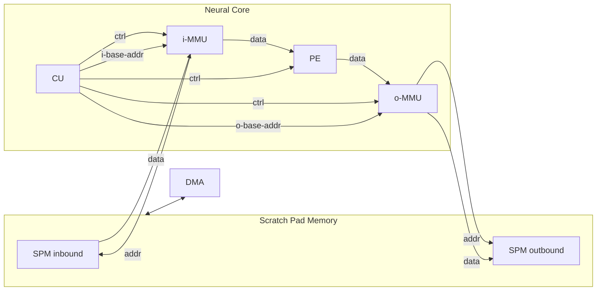

# Neural Core

[Systolic Arrays](SystolicArray.md) are high throughput high latency computing architectures. They can be very efficient if we controll them with care.

To support more general operations for linear algebra, we need to split the computing logic from the addressing and controlling logic. So the architecture should look like below:

The overall architecture of the proposed Neural Core will look like a multi-layered 3D grid. If you look along z-axis, you will find them forming a pipeline.

Above is the pipeline of a Neural Unit (NU), which is an element of the processing element pipeline in the Neural Core. They can organize as systolic arrays or parallelized thread cores. 

This flexible architecture is managed by MMU, where all the data flow is controlled. To reduce the number of running transistors, we fused the systolic design with a parallelism design. All $\mu$-CU and i-$\mu$MMU will have a stair-like scheduling characteristics. Though this design choice may lead to high latency, I think it is still quite efficient: It preserves high throughput with fair amount of registers and arithmetic units. Of course you can have a multiplexed control set to manage this grid, but that will have more overhead. For example, you need a large piece of logic to implement the parallelism and another one to avoid bubbles in Neural Units.

An Neural Processing Unit (NPU) can have multiple Neural Cores (NCore). Each Neural Core has a 2 dimensional grid of Neural Uint (NU). Each Neural Unit has its own micro-CU ($\mu$-CU), micro-MMU for both input and output(i-$\mu$MMU/o-$\mu$MMU) and [processing element (PE)](ProcessingElement.md). Having large registers that hold the matrix is impossible. So the design follows other NPU designs, using a Scratch Pad Memory to store input and output data. Each $\mu$MMU is directly connected to SPM to obtain a instant access to the data.