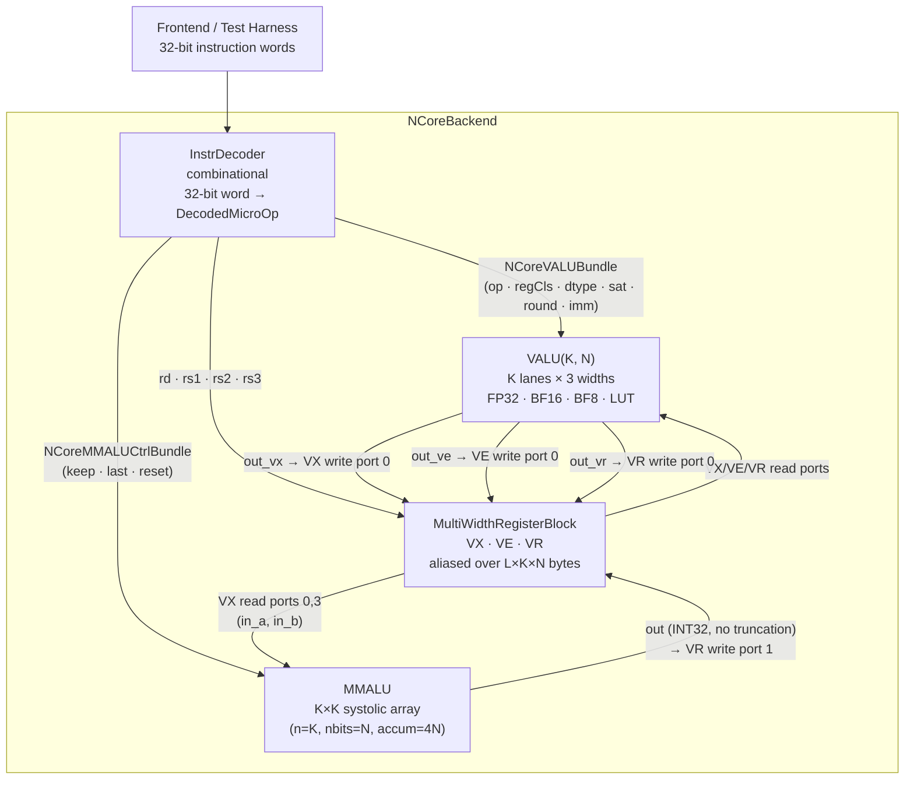
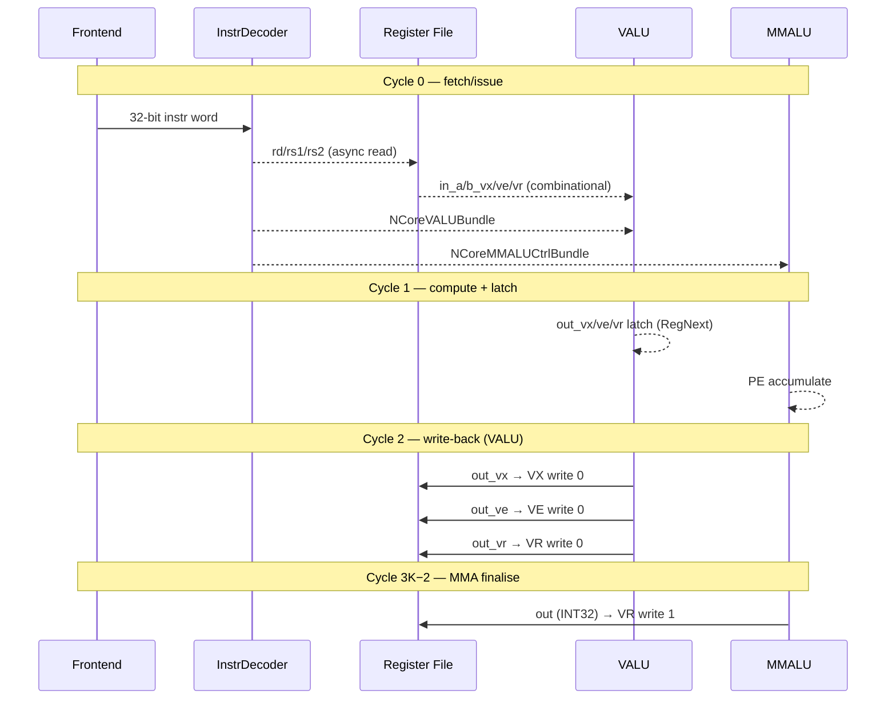

# Neural Core (NCoreBackend)

[TOC]

The Neural Core (`NCoreBackend`) is the central execution unit of the NPU.
It integrates an instruction decoder, a multi-width register file, the systolic-array
matrix engine (MMALU), and the vector ALU (VALU) into a single pipelined backend.

The design philosophy mirrors a lightweight super-scalar processor:
while the systolic array is busy computing a matrix multiplication over many clock cycles,
the VALU and load/store units can overlap with it to maximise throughput.

---

## Components

```mermaid
graph TB
    FE["Frontend / Test Harness\n32-bit instruction words"]

    FE --> DEC

    subgraph NCoreBackend
        DEC["InstrDecoder\ncombinational\n32-bit word → DecodedMicroOp"]

        RF["MultiWidthRegisterBlock\nVX · VE · VR\naliased over L×K×N bytes"]

        MMA["MMALU\nK×K systolic array\n(n=K, nbits=N, accum=4N)"]

        VALU["VALU(K, N)\nK lanes × 3 widths\nFP32 · BF16 · BF8 · LUT"]

        DEC -->|"NCoreVALUBundle\n(op · regCls · dtype · sat · round · imm)"| VALU
        DEC -->|"NCoreMMALUCtrlBundle\n(keep · last · reset)"| MMA
        DEC -->|"rd · rs1 · rs2 · rs3"| RF

        RF -->|"VX/VE/VR read ports"| VALU
        RF -->|"VX read ports 0,3\n(in_a, in_b)"| MMA

        VALU -->|"out_vx → VX write port 0"| RF
        VALU -->|"out_ve → VE write port 0"| RF
        VALU -->|"out_vr → VR write port 0"| RF
        MMA  -->|"out (INT32, no truncation)\n→ VR write port 1"| RF
    end
```

### InstrDecoder (`src/main/scala/isa/instrDecoder.scala`)

- Purely combinational; one pipeline stage.
- Input: 32-bit instruction word.
- Output: `DecodedMicroOp` bundle (family, op, regCls, rd/rs1/rs2/rs3, imm, mma control).
- Asserts `io.illegal` for reserved opcodes, reserved funct7 width bits, or CVT src == dst.
- The decoded bundle arrives at VALU and MMALU in the **same clock cycle** as the instruction word.

### MultiWidthRegisterBlock (`src/main/scala/sram/multiWidthRegister.scala`)

- Physical storage: `L × K × (N/8)` bytes (256 B at default parameters).
- Three aliased views: VX (K × N), VE (K × 2N), VR (K × 4N).
- Async reads; synchronous writes.
- See [Registers](Registers.md) for the full port table and aliasing rules.

### MMALU (`src/main/scala/alu/mma/mma.scala`)

- Systolic array with K×K processing elements.
- Parameters: `n = K` (array side), `nbits = N`, `accum_nbits = 4N`.
- Latency: `3K − 2` clock cycles from first input row to last output column.
- Output: `Vec(K, SInt(4N.W))` — **written directly to VR write port 1 without truncation**.
- See [Systolic Array](SystolicArray.md) for detailed timing.

### VALU (`src/main/scala/alu/vec/vec.scala`)

- K lanes of N(bits) each; supports VX (N), VE (2N), and VR (4N) width classes.
- Includes IEEE754 Tier-2 FP32 helpers (fadd/fmul/fma), BF16 truncation, BF8 E4M3/E5M2 encoding.
- 1-tick output register for all ops except `vfma` (2 ticks).
- See [VectorALU](VectorALU.md) for the full instruction reference.

---

## Execution Pipeline

```mermaid
sequenceDiagram
    participant FE as Frontend
    participant DEC as InstrDecoder
    participant RF as Register File
    participant VU as VALU
    participant MMA as MMALU

    note over FE,MMA: Cycle 0 — fetch/issue

    FE->>DEC: 32-bit instr word
    DEC-->>RF: rd/rs1/rs2 (async read)
    RF-->>VU: in_a/b_vx/ve/vr (combinational)
    DEC-->>VU: NCoreVALUBundle
    DEC-->>MMA: NCoreMMALUCtrlBundle

    note over FE,MMA: Cycle 1 — compute + latch
    VU-->>VU: out_vx/ve/vr latch (RegNext)
    MMA-->>MMA: PE accumulate

    note over FE,MMA: Cycle 2 — write-back (VALU)
    VU->>RF: out_vx → VX write 0
    VU->>RF: out_ve → VE write 0
    VU->>RF: out_vr → VR write 0

    note over FE,MMA: Cycle 3K−2 — MMA finalise
    MMA->>RF: out (INT32) → VR write 1
```

!!! note "VALU write-back requires 2-cycle hold"
    The VALU output register adds one cycle of latency. The backend (or a future frontend)
    must hold the decoded vector op active for **2 clock cycles** to fire the write-back
    when `out_vx/ve/vr` are valid.

!!! note "MMALU and VALU can overlap"
    The MMALU pipeline (`3K−2` cycles) is independent of the VALU pipeline (1–2 cycles).
    A frontend scheduler can issue vector instructions (CVT, BCAST, FP) during the systolic
    array's drain phase to hide most of the quantization overhead.

---

## Parameter Constraints

| Constraint | Reason |
|:---|:---|
| `K == mmalu.n` | MMALU array side must equal VALU lane count. Enforced by `require` in `NCoreBackend`. |
| `L % 4 == 0` | VR aliasing needs VX rows in groups of 4. Enforced by `require` in `MultiWidthRegisterBlock`. |
| `N == mmalu.nbits` | MMALU input lane width must match VALU base lane width. |
| `4N == mmalu.accum_nbits` | MMALU accumulator width must match VR lane width. |

---

## Source Files

| File | Description |
|:---|:---|
| `src/main/scala/backend/SimpleBackend.scala` | `NCoreBackend` module |
| `src/main/scala/isa/instrDecoder.scala` | `InstrDecoder` combinational module |
| `src/main/scala/isa/instrFormat.scala` | Bit-position constants, enums |
| `src/main/scala/isa/instSetArch.scala` | Opcode family and funct3 definitions |
| `src/main/scala/isa/NpuAssembler.scala` | Scala-side assembler helpers |
| `src/main/scala/sram/multiWidthRegister.scala` | `MultiWidthRegisterBlock` |
| `src/main/scala/alu/vec/vec.scala` | `VALU` module + `Qfmt` LUT tables |
| `src/main/scala/alu/vec/fp.scala` | `IEEE754` FP32/BF16/BF8 helpers + `FpRef` reference |
| `src/main/scala/alu/mma/mma.scala` | `MMALU` systolic engine |

---

## Test Coverage

| Spec | What it covers |
|:---|:---|
| `InstrDecoderSpec` | All 13 opcode families: funct3, regCls, sat, round, rd/rs1/rs2, illegal detection |
| `MultiWidthRegisterSpec` | VX write/read, VX→VE alias, VR→VX alias, external port |
| `VALUArith/Logic/MinMax/Reduce/Lut/CastSpec` | VALU functional correctness (K=8) |
| `VALUFP32Spec` | FP32 add/mul/fma bit-accurate vs `java.lang.Float` |
| `VALUCvtSpec` | All CVT pairs, BF16 round-trip, BF8 E4M3 encoding |
| `VALUActivationSpec` | Softmax and GELU as primitive sequences |
| `NCoreBackendQuantSpec` | End-to-end: MMA → vcvt → vfma → vcvt quantization pipeline |
