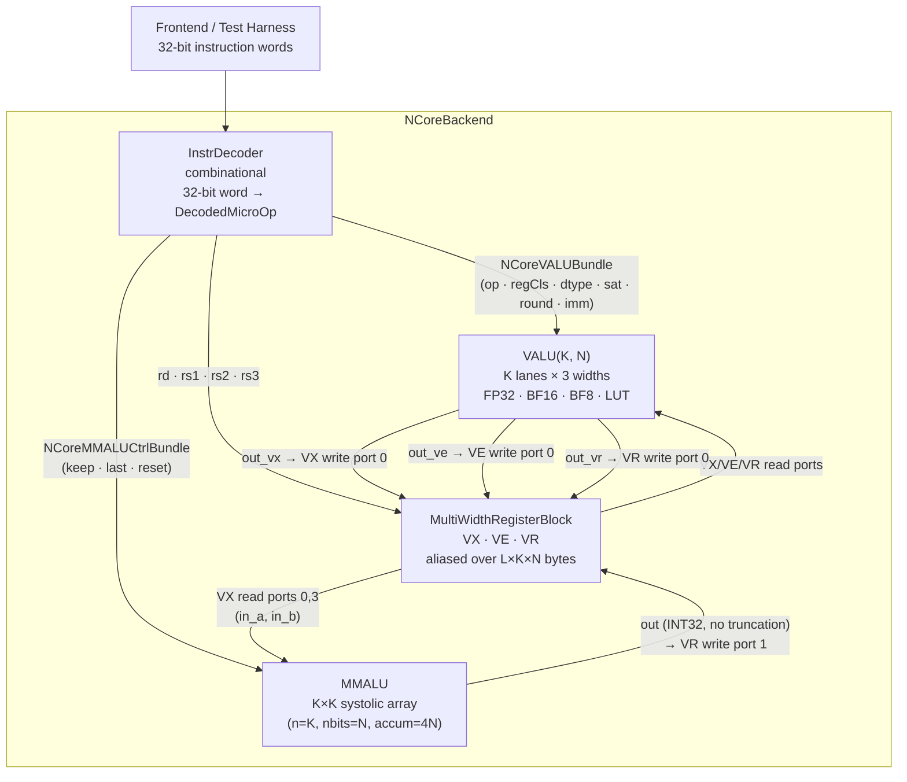
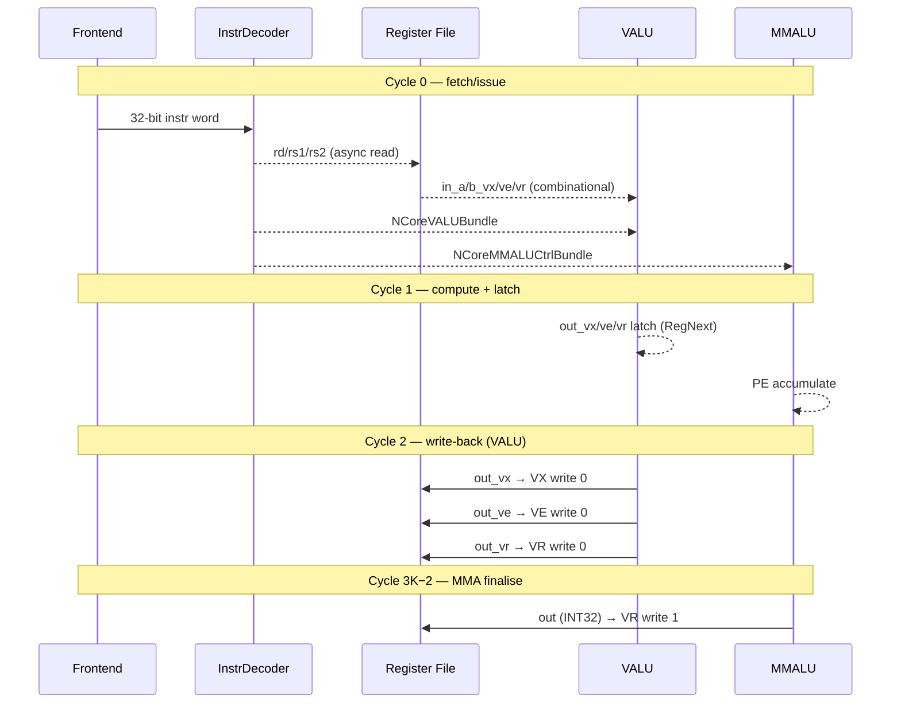
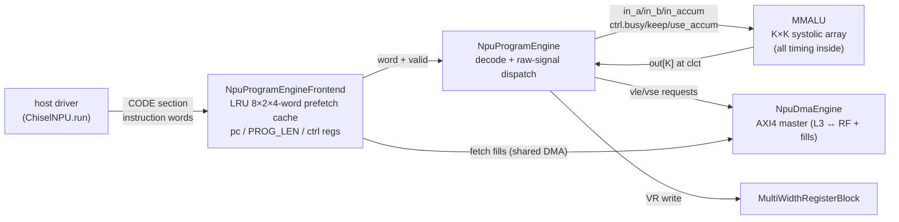

# Neural Core (NCoreBackend)

[TOC]

The Neural Core (`NCoreBackend`) is the VALU-inclusive backend used by the
test/legacy path.  It integrates an instruction decoder, a multi-width register
file, the systolic-array matrix engine (MMALU), and the vector ALU (VALU) into a
single pipelined backend.

!!! note "The FPGA top is the Program Engine, not NCoreBackend"
    The FPGA top (`src/main/scala/top/top.scala`) is the streamed
    `NpuProgramEngineFrontend` (K=16, W=4), which contains the decoder, DMA and
    MMALU but **not** VALU.  See the Program Engine section below and
    [`../designs/04.streamed-issuing.md`](../designs/04.streamed-issuing.md).

The design philosophy mirrors a lightweight super-scalar processor:
while the systolic array is busy computing a matrix multiplication over many clock cycles,
the VALU and load/store units can overlap with it to maximise throughput.

<div style="text-align: center">

</div>

---

## Components


```mermaid
graph TB
    FE["Frontend / Test Harness\n32-bit instruction words"]

    FE --> DEC

    subgraph NCoreBackend
        DEC["InstrDecoder\ncombinational\n32-bit word → DecodedMicroOp"]

        RF["MultiWidthRegisterBlock\nVX · VE · VR\naliased over L×K×N bytes"]

        MMA["MMALU\nK×K systolic array\n(n=K, nbits=N, accum=4N)"]

        VALU["VALU(K, N)\nK lanes × 3 widths\nFP32 · BF16 · BF8 · LUT"]

        DEC -->|"NCoreVALUBundle\n(op · regCls · dtype · sat · round · imm)"| VALU
        DEC -->|"NCoreMMALUCtrlBundle\n(keep · last · reset)"| MMA
        DEC -->|"rd · rs1 · rs2 · rs3"| RF

        RF -->|"VX/VE/VR read ports"| VALU
        RF -->|"VX read ports 0,3\n(in_a, in_b)"| MMA

        VALU -->|"out_vx → VX write port 0"| RF
        VALU -->|"out_ve → VE write port 0"| RF
        VALU -->|"out_vr → VR write port 0"| RF
        MMA  -->|"out (INT32, no truncation)\n→ VR write port 1"| RF
    end
```

### InstrDecoder (`src/main/scala/isa/instrDecoder.scala`)

- Purely combinational; one pipeline stage.
- Input: 32-bit instruction word.
- Output: `DecodedMicroOp` bundle (family, op, regCls, rd/rs1/rs2/rs3, imm, mma control).
- Asserts `io.illegal` for a reserved opcode (any value outside the active family set, checked against the full 7-bit field), a reserved `funct3` within a family, reserved `funct7` width bits (`funct7[1:0]=3`) or dtype (`funct7[6:5]=3`), or an unmatched CVT `(dst, src)` pair (reserved format code or `src == dst`).
- The decoded bundle arrives at VALU and MMALU in the **same clock cycle** as the instruction word.

### MultiWidthRegisterBlock (`src/main/scala/sram/multiWidthRegister.scala`)

- Physical storage: `L × K × (N/8)` bytes (256 B at default parameters).
- Three aliased views: VX (K × N), VE (K × 2N), VR (K × 4N).
- Async reads; synchronous writes.
- See [Registers](Registers.md) for the full port table and aliasing rules.

### MMALU (`src/main/scala/alu/mma/mma.scala`)

- Systolic array with K×K processing elements.
- Parameters: `n = K` (array side), `nbits = N`, `accum_nbits = 4N`.
- Latency: `3K − 2` clock cycles from first input row to last output column.
- Output: `Vec(K, SInt(4N.W))` — **written directly to VR write port 1 without truncation**.
- See [Systolic Array](SystolicArray.md) for detailed timing.

### VALU (`src/main/scala/alu/vec/vec.scala`)

- K lanes of N(bits) each; supports VX (N), VE (2N), and VR (4N) width classes.
- Includes IEEE754 Tier-2 FP32 helpers (fadd/fmul/fma), BF16 truncation, BF8 E4M3/E5M2 encoding.
- 1-tick output register for all ops except `vfma` (2 ticks).
- See [VectorALU](VectorALU.md) for the full instruction reference.

---

## Execution Pipeline


```mermaid
sequenceDiagram
    participant FE as Frontend
    participant DEC as InstrDecoder
    participant RF as Register File
    participant VU as VALU
    participant MMA as MMALU

    note over FE,MMA: Cycle 0 — fetch/issue

    FE->>DEC: 32-bit instr word
    DEC-->>RF: rd/rs1/rs2 (async read)
    RF-->>VU: in_a/b_vx/ve/vr (combinational)
    DEC-->>VU: NCoreVALUBundle
    DEC-->>MMA: NCoreMMALUCtrlBundle

    note over FE,MMA: Cycle 1 — compute + latch
    VU-->>VU: out_vx/ve/vr latch (RegNext)
    MMA-->>MMA: PE accumulate

    note over FE,MMA: Cycle 2 — write-back (VALU)
    VU->>RF: out_vx → VX write 0
    VU->>RF: out_ve → VE write 0
    VU->>RF: out_vr → VR write 0

    note over FE,MMA: Cycle 3K−2 — MMA finalise
    MMA->>RF: out (INT32) → VR write 1
```

!!! note "VALU write-back requires 2-cycle hold"
    The VALU output register adds one cycle of latency. The backend (or a future frontend)
    must hold the decoded vector op active for **2 clock cycles** to fire the write-back
    when `out_vx/ve/vr` are valid.

!!! note "MMALU and VALU can overlap"
    The MMALU pipeline (`3K−2` cycles) is independent of the VALU pipeline (1–2 cycles).
    A frontend scheduler can issue vector instructions (CVT, BCAST, FP) during the systolic
    array's drain phase to hide most of the quantization overhead.

---

## Parameter Constraints

| Constraint | Reason |
|:---|:---|
| `K == mmalu.n` | MMALU array side must equal VALU lane count. Enforced by `require` in `NCoreBackend`. |
| `L % 4 == 0` | VR aliasing needs VX rows in groups of 4. Enforced by `require` in `MultiWidthRegisterBlock`. |
| `N == mmalu.nbits` | MMALU input lane width must match VALU base lane width. |
| `4N == mmalu.accum_nbits` | MMALU accumulator width must match VR lane width. |

---

## Source Files

| File | Description |
|:---|:---|
| `src/main/scala/backend/SimpleBackend.scala` | `NCoreBackend` module |
| `src/main/scala/isa/instrDecoder.scala` | `InstrDecoder` combinational module |
| `src/main/scala/isa/instrFormat.scala` | Bit-position constants, enums |
| `src/main/scala/isa/instSetArch.scala` | Opcode family and funct3 definition *values* |
| `src/main/scala/isa/InstrTable.scala` | Authoritative decode map (`(opcode,funct3)` → mnemonic/VecOp, CVT pairs) |
| `src/main/scala/isa/NpuAssembler.scala` | Scala-side assembler helpers |
| `src/main/scala/isa/NpuDisassembler.scala` | Table-driven disassembler |
| `src/main/scala/sram/multiWidthRegister.scala` | `MultiWidthRegisterBlock` |
| `src/main/scala/alu/vec/vec.scala` | `VALU` module + `Qfmt` LUT tables |
| `src/main/scala/alu/vec/fp.scala` | `IEEE754` FP32/BF16/BF8 helpers + `FpRef` reference |
| `src/main/scala/alu/mma/mma.scala` | `MMALU` systolic engine |

---

## Test Coverage

| Spec | What it covers |
|:---|:---|
| `InstrDecoderSpec` | All 13 opcode families: funct3, regCls, sat, round, rd/rs1/rs2, illegal detection |
| `MultiWidthRegisterSpec` | VX write/read, VX→VE alias, VR→VX alias, external port |
| `VALUArith/Logic/MinMax/Reduce/Lut/CastSpec` | VALU functional correctness (K=8) |
| `VALUFP32Spec` | FP32 add/mul/fma bit-accurate vs `java.lang.Float` |
| `VALUCvtSpec` | All CVT pairs, BF16 round-trip, BF8 E4M3 encoding |
| `VALUActivationSpec` | Softmax and GELU as primitive sequences |
| `NCoreBackendQuantSpec` | End-to-end: MMA → vcvt → vfma → vcvt quantization pipeline |
| `InstrTableSpec` | The authoritative decode table + exhaustive illegal/aliasing sweep |
| `NpuDisassemblerSpec` | `word → text` round-trip over every table entry |
| `NpuProgramEngineTrajSpec`, `StreamedNSessionSpec`, `StreamedChainedSpec` | mma sessions: per-mma column captures, C operand, illegal halt, chaining |
| `NpuProgramEngineFrontendSpec` | Sessions streamed through the fetch/`ctrl_lite` frontend |
| `CaptureDeterminismSpec`, `CaptureTraceSpec`, `LateStoreCaptureSpec` | capture determinism, traces, late-store capture |
| `NpuDmaEngineSpec` | the engine's AXI4 master |

---

## Program Engine (`NpuProgramEngine` + `NpuProgramEngineFrontend`)

The FPGA program path (the engine that replaced the fixed-function
`npu_dma_master`): a frontend streams ISA words from DDR, and a deliberately
thin engine decodes each instruction and drives the MMALU's raw signals
directly. **Status: implemented and silicon-verified at K=16; the current FPGA
build (xcvu9p) uses window depth `W=4` and closes timing at 200 MHz** (see the
handoff for the bring-up record).

### Architecture


```mermaid
graph LR
    HOST["host driver\n(ChiselNPU.run)"] -->|"CODE section\ninstruction words"| FE
    FE["NpuProgramEngineFrontend\nLRU 8×2×4-word prefetch cache\npc / PROG_LEN / ctrl regs"] -->|"word + valid"| ENG
    ENG["NpuProgramEngine\ndecode + raw-signal dispatch"] -->|"in_a/in_b/in_accum\nctrl.busy/keep/use_accum"| MMA
    ENG -->|"vle/vse requests"| DMA["NpuDmaEngine\nAXI4 master (L3 ↔ RF + fills)"]
    MMA["MMALU\nK×K systolic array\n(all timing inside)"] -->|"out[K] at clct"| ENG
    ENG -->|"VR write"| RF["MultiWidthRegisterBlock"]
    FE -->|"fetch fills (shared DMA)"| DMA
```

- **Frontend** (`npuFrontend.scala`): fetches 16 B lines (4 words) from CODE
  via the shared DMA, caches them in an 8-set×2-way LRU cache, streams words
  in order, counts `mma.last` frames, and exposes the ctrl register map
  (CTRL/STATUS/ERR_INFO/FETCH_STATS/PROG_LEN + debug). Writes to
  PROG_LEN/start invalidate the cache.
- **Engine** (`npuProgramEngine.scala`): states `IDLE, DMA_REQ, DMA_WAIT,
  DONE_1, ILLEGAL` plus a capture FIFO (vd queue, depth 2K+4). For each
  `mma`/`mma.last` it asserts one feed tick (`busy=1, keep=1, use_accum=1`)
  with the combinational RF reads `in_a=VX[vs1]`, `in_b=VX[vs2]`,
  `in_accum=VR[vs3]` (x0 → 0), stays in IDLE (back-to-back feeds = the MMALU
  K-burst), and pushes `vd`. Each clct pulse (one per feed, 2n−1 later) pops
  the FIFO and writes the collector's output column to `VR[vd]`. After an
  `mma.last`'s own capture, `keep` drops for one tick — the MMALU boundary
  that resets the PEs for the next session. `keep` is held high otherwise
  (the MMALU idle pattern).

### The mma session (K-burst) model

```
# one session (m feeds) → m output columns
vle8  A[:,0] → VX[a0];  vle8  B[0] → VX[b0]
mma   vd0, a0, b0, c          # feed 0; captures output column c0
vle8  A[:,1] → VX[a1];  vle8  B[1] → VX[b1]
mma   vd1, a1, b1, c          # feed 1; captures output column c1
...
mma.last vdN, aN, bN, c       # session end (+ keep=0 boundary)
nop × nop_wait                # clct/drain window
vse32 vd0 → OUT; vse32 vd1 → OUT; ...
```

- Each `mma` = one feed tick; the PEs accumulate the session's products
  (`PE[i][j] += A[i]·B[j]` per feed — the MMALU's native K-burst).
- Each mma's clct captures **one output column** of the session product to
  its own `vd` (sim-verified: consecutive feeds → consecutive columns).
- `mma.last` marks the session end; the keep=0 boundary (after its capture)
  resets the PEs.
- `vd_k[i] = Σ_m a_m[i]·b_m[col_k] + C[i]` (C = VR[vs3], added via
  `use_accum`/`in_accum` at the capture).
- **Known silicon caveat**: the captured column index is set by the issue
  timing (the collector's phase); the sim verifies the clean consecutive
  columns, and the silicon's phase must be aligned to the frontend's issue
  pacing (documented follow-up).

### Status

| Item | State |
|:-----|:------|
| Engine simplification (decode + dispatch, capture FIFO) | ✅ implemented |
| Session model sim-verified (per-mma column captures) | ✅ `NpuProgramEngineTrajSpec` / `StreamedNSessionSpec` / `StreamedChainedSpec` / `NpuProgramEngineFrontendSpec` |
| Driver `ChiselNPU.run(instructions, memories)` | ✅ 0.2.1, unit-tested (FakeNative engine model) |
| Silicon (K=16, current build W=4, 200 MHz on xcvu9p) | ✅ timing closed; `chisel_npu_py` HW suite 7/7 pass |

