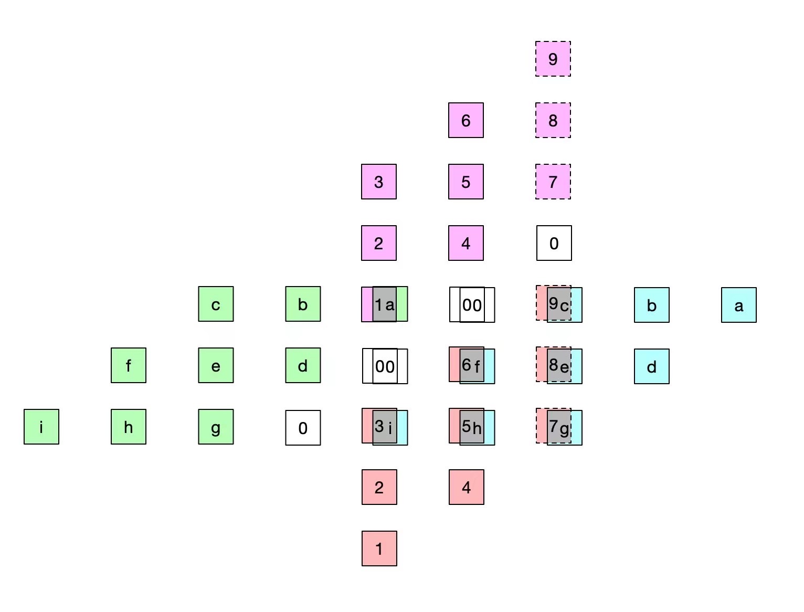

# Processing Element

```ascii_art
        ACCUM   TOP
           \     |
            \    |
             \___v___
             | Proc  |
   LEFT ---->| Elem  |-----> RIGHT
              ¯¯¯|¯¯¯\
                 |    \
                 v     \
               BOTTOM   OUT (to TLB mapped memory)
```

Processing Element is the fundamental element in systolic array. This is a basic implementation of a 2D PE for 2D systolic array.



## Timing

PE component will only accumulate the result if the `ACCUM` is high. This is efficient for pipelining multiple GEMM in stream.

wavedrom (
    { signal: [
      { name: "clk", wave:"P......", period: 4 },
      { name: "top_in", wave: "x====xx", data:["top_1", "top_2", "top_3", "top_4"], period: 4},
      { name: "left_in", wave: "x====xx", data:["left_1", "left_2", "left_3", "left_4"], period: 4},
      { name: "accu", wave: "1...01.", period: 4},
      { name: "right_out", wave: "xx====x", data:["top_1", "top_2", "top_3", "top_4"], period: 4},
      { name: "bottom_out", wave: "xx====x", data:["left_1", "left_2", "left_3", "left_4"], period: 4},
      { name: "out", wave: "xx====x", data:["prod1=top_1*left_1", "prod_1 + top_2 * left_2", "prod_3=top_3 * left_3", "prod_3 + top_4 * left_4"], period: 4},
      ] }
)
