# Quantization Pipeline

[TOC]

This page shows how to implement **post-GEMM INT8 quantization** using the NPU instruction
set — from raw INT8 inputs, through a matrix multiply, scale-and-shift in FP32, and back
to INT8 for the next layer.

The key insight is that the NPU's MMALU accumulates in **INT32** (full precision), and the
VALU's `vcvt` / `vfma` family converts between INT32, FP32, and INT8 entirely on-chip.
No host-side dequantization round-trip is needed.

---

## Background: Uniform Affine Quantization

Linear quantization maps a floating-point value $x$ to an integer $q$ as:

$$q = \text{clip}\!\left(\text{round}\!\left(\frac{x}{\text{scale}}\right) + \text{zero\_point},\; q_{\min},\; q_{\max}\right)$$

And dequantizes as:

$$\hat{x} = \text{scale} \cdot (q - \text{zero\_point})$$

For INT8, $q \in [-128, 127]$.

After a matrix multiplication $Y = W \cdot X$ (weights × activations), the accumulator output is an INT32 sum. To produce the output activations for the next layer, we need to:

1. **Dequantize** the INT32 accumulator: $y_{\text{fp32}} = \text{acc} \times S_W \times S_X$
2. **Apply bias/scale**: $y_{\text{fp32}} = y_{\text{fp32}} \times S_{\text{out}} + \text{zp}_{\text{out}}$
3. **Requantize** to INT8: $q_{\text{out}} = \text{clip}(\text{round}(y_{\text{fp32}}), -128, 127)$

Steps 2 and 3 collapse into a single `vfma` + `vcvt_f32_s8` on the NPU.

---

## Register Allocation

Using the default parameters (K=8 lanes, N=8, L=32):

| Register | Class | Content |
|:---|:---:|:---|
| VX[0..K-1] | VX | Quantized INT8 input activations X[0..K-1] |
| VX[K..2K-1] | VX | Quantized INT8 weights W[0..K-1] |
| VR[0] | VR | Combined scale: `S_W × S_X × S_out⁻¹` (FP32, broadcast) |
| VR[1] | VR | Output zero-point: `zp_out` (FP32, broadcast) |
| VR[2] | VR | MMALU INT32 accumulator output → FP32 intermediate |
| VX[31] | VX | Final INT8 quantized output |

---

## Instruction Sequence

### Setup (run once per layer, outside the inner loop)

The hardware does not yet have a constant-load instruction for 32-bit values.
The recommended approach in current software (and tests) is:

1. Write the FP32 constant bytes into a VX register via the **external RF write port** (used by a loader/DMA or the test harness).
2. Issue `bcast.vr` to broadcast VX lane 0 (reinterpreted as FP32) across all K VR lanes.

```
# Pre-load scale FP32 bits into VX[0] lane 0 via ext_wr port (DMA / loader)
ext_write  VX[0], float_bits(scale)   # K copies of the same 4-byte FP32 word

# Splat VX[0] lane 0 across VR[0] (all K lanes)
bcast.vr  VR[0], VX[0]               # funct7: width=VR

# Pre-load zp FP32 bits into VX[1]
ext_write  VX[1], float_bits(zp)
bcast.vr  VR[1], VX[1]
```

Using `NpuAssembler` in Scala tests (mirrors `NCoreBackendQuantSpec`):
```scala
import isa.NpuAssembler._
import java.lang.Float.floatToRawIntBits

val scale     = 0.0078125f   // example: 1/128
val zp        = 0.0f
val scaleBits = floatToRawIntBits(scale)
val zpBits    = floatToRawIntBits(zp)

// Write FP32 word into VX[0] lane 0 via ext write port (all K lanes get the same value)
extWrite(dut, addr=0, Array.fill(K)((scaleBits & 0xFF).toByte.toInt))
// NOTE: for a 32-bit FP value in a VR register the backend writes 4 consecutive
// VX rows; using the VR ext write port is cleaner if available.

// Broadcast VX[0] lane 0 → VR[0], all K lanes
val setup = Seq(
  vbcast(rd=0, rs1=0, width=VR),    // scale → VR[0]
  vbcast(rd=1, rs1=1, width=VR),    // zp    → VR[1]
)
```

### Inner loop (one K-lane dot product)

```
# 1. Matrix Multiply-Accumulate: VR[2] = Σ VX[0..K-1] × VX[K..2K-1]  (INT32)
mma      VR[2], VX[0], VX[K], keep=true
mma.last VR[2], VX[0], VX[K]

# 2. INT32 → FP32
vcvt_s32_f32  VR[2], VR[2]       # in: VR[2] INT32, out: VR[2] FP32

# 3. FP32 FMA: VR[2] = VR[2] * scale + zp
vfma  VR[2], VR[2], VR[0], VR[1]

# 4. FP32 → INT8 saturated
vcvt_f32_s8  VX[31], VR[2]
```

Using `NpuAssembler`:
```scala
val innerLoop = Seq(
  mma    (rd=2, rs1=0, rs2=8, keep=true),
  mmaLast(rd=2, rs1=0, rs2=8),
  vcvt_s32_f32(rd=2, rs1=2),
  vfma  (rd=2, rs1=2, rs2=0, rs3=1),
  vcvt_f32_s8(rd=31, rs1=2, sat=true),
)
// poke as: (instr.toLong & 0xFFFFFFFFL).U
```

---

## Timing

```mermaid
gantt
    title Quantization pipeline (K=4 example, 3K-2 = 10 MMA cycles)
    dateFormat  X
    axisFormat  %s

    section Setup (once, via ext_wr + bcast)
    ext write + bcast scale VR0 : 0, 3
    ext write + bcast zp VR1    : 3, 6

    section Inner loop
    mma (streaming)     : 6, 16
    mma.last            : 16, 17
    vcvt_s32_f32        : 17, 18
    vfma (2 ticks)      : 18, 20
    vcvt_f32_s8         : 20, 21
```



| Phase | Instructions | Ticks |
|:---|:---|:---:|
| Setup (once) | 2× ext_write (DMA/loader) + 2× bcast.vr | 4 |
| MMA pipeline | mma × (K-1) + mma.last | 3K−2 |
| INT32 → FP32 | vcvt_s32_f32 | 1 |
| Scale + shift | vfma | 2 |
| FP32 → INT8 | vcvt_f32_s8 | 1 |
| **Per-tile total** | (excluding setup) | **3K** |

For K=64 (top-level configuration): **192 clock cycles per K×K tile** plus 2 `bcast.vr` setup cycles amortised across many tiles (the ext_write/DMA takes place before the pipeline starts).

---

## Timing Diagram

wavedrom (
{ signal: [
  { name: "clk",              wave: "P.................",  period: 2 },
  { name: "bcast.vr scale",   wave: "x=x...............",  data:["bcast"], period: 2 },
  { name: "→ VR[0] valid",    wave: "xx=x..............",  data:["scale×K"], period: 2 },
  {},
  { name: "mma / mma.last",   wave: "x.x==========x....",  data:["r0","r1","…","rK-1","last"], period: 2 },
  { name: "→ VR[2] (INT32)",  wave: "x.............=x..",  data:["acc"], period: 2 },
  {},
  { name: "vcvt_s32_f32",     wave: "x.............x=x.",  data:["cvt"], period: 2 },
  { name: "→ VR[2] (FP32)",   wave: "x..............x=x",  data:["fp"], period: 2 },
  {},
  { name: "vfma",             wave: "x..............x=x",  data:["fma"], period: 2 },
  { name: "vcvt_f32_s8",      wave: "x...............x=",  data:["sat"], period: 2 },
  { name: "→ VX[31] (INT8)",  wave: "x................=",  data:["q_out"], period: 2 }
]}
)

---

## Complete Worked Example (K=8)

The following Scala test from `NCoreBackendQuantSpec` demonstrates the full pipeline:

```scala
// 1. Load quantized INT8 inputs and weights into VX via ext write port
extWrite(dut, addr=0, inputActivations)  // → VX[0]
extWrite(dut, addr=8, weights)           // → VX[8..15] (K rows)

// 2. Write FP32 scale/zp via ext write port, then broadcast into VR
extWrite(dut, addr=0, Array.fill(K)(scaleBits & 0xFF))  // VX[0] ← scale bytes
extWrite(dut, addr=1, Array.fill(K)(zpBits & 0xFF))     // VX[1] ← zp bytes
issue(dut, vbcast(rd=0, rs1=0, width=VR))               // → VR[0]: scale × K lanes
issue(dut, vbcast(rd=1, rs1=1, width=VR))               // → VR[1]: zp × K lanes

// 3. Run MMA (K rows, keep=true for all but last)
for (row <- 0 until K-1) {
  dut.io.mma_a_addr.poke(row.U)
  dut.io.mma_b_addr.poke((row + K).U)
  issue(dut, mma(rd=2, rs1=row, rs2=row+K, keep=true))
}
issue(dut, mmaLast(rd=2, rs1=K-1, rs2=2*K-1))
// → VR[2] now holds INT32 dot product

// 4. Convert and quantize
issue(dut, vcvt_s32_f32(rd=2, rs1=2))              // INT32 → FP32
issue(dut, vfma(rd=2, rs1=2, rs2=0, rs3=1))         // ×scale + zp
issue(dut, vcvt_f32_s8(rd=31, rs1=2, sat=true))     // FP32 → INT8 saturated

// 5. Read result from VX[31]
dut.io.ext_rd_addr.poke(31.U)
val result = Array.tabulate(K)(i => dut.io.ext_rd_data(i).peek().litValue.toByte.toInt)
```

### Numerical example

For K=1 scalar lane, inputs `a=10`, `w=5`, scale=0.01, zp=0:

| Step | Computation | Result |
|:---|:---|:---|
| INT8 × INT8 | 10 × 5 | 50 (INT32) |
| INT32 → FP32 | `float(50)` | 50.0f |
| vfma | `50.0 × 0.01 + 0.0` | 0.5f |
| FP32 → INT8 | `round(0.5)` saturated | 1 (INT8) |

---

## Pipelining with Future Tiles

Because VALU instructions execute independently of the MMALU pipeline, a future out-of-order
front-end can overlap the post-quantization steps of tile N with the MMA drain of tile N+1:

```mermaid
gantt
    title Pipelined quantization (two K-tile batches)
    dateFormat X
    axisFormat %s

    section Tile 0
    MMA streaming      : 0, 10
    mma.last           : 10, 11
    vcvt + vfma + cvt  : 11, 15

    section Tile 1 (overlapped)
    MMA streaming      : 11, 21
    mma.last           : 21, 22
    vcvt + vfma + cvt  : 22, 26
```



The VALU operations for tile 0 (cycles 11–14) overlap the MMA streaming for tile 1
(cycles 11–20), hiding the 4-cycle quantization overhead.

---

## Related Pages

- [ISA Reference](../designs/01.isa.md) — full instruction encoding and opcode families
- [VectorALU](VectorALU.md) — VALU instruction reference (CVT, FP, FMA)
- [Registers](Registers.md) — VX/VE/VR aliasing and port assignment
- [Systolic Array](SystolicArray.md) — MMALU timing (3K−2 cycle pipeline)
- [Neural Core](NeuralCore.md) — backend architecture and parameter constraints
