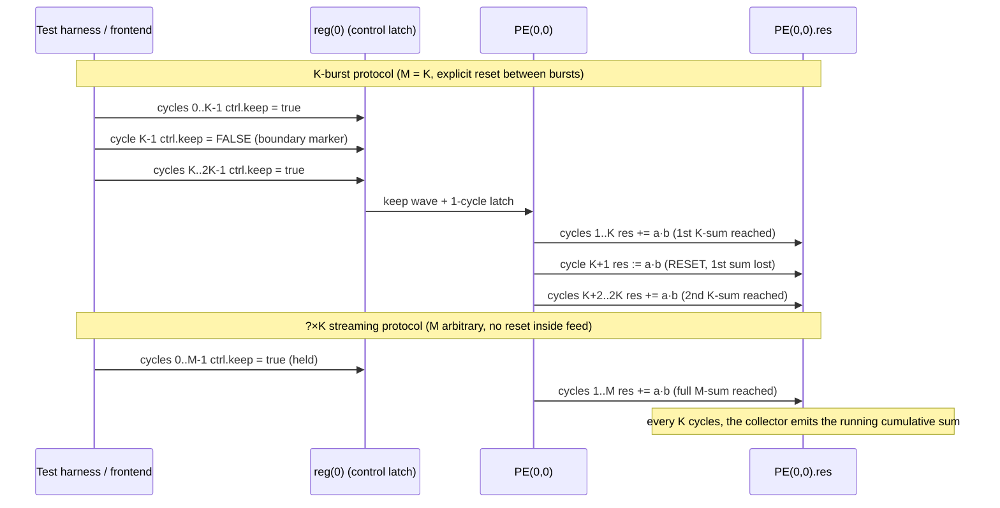

# Systolic Array

[TOC]

Systolic arrays are often the fundamental execution unit in modern NPU implementations. They are efficient in matrix multiplication, which is widely adopted in neural networks. However, it is not flexible to execute high performance vector or scalar operations. In general, a systolic array will have latency of $3N-2$ (from the first element of input matrices to the final element of the output matrix). To maximize the gain from a systolic array architecture, most implementation will have around $64\times 64$ grid of [PEs](ProcessingElement.md). Larger size of the grid will suffer more from the memory wall. Hence hardware engineers need to battle with this multi-constrained problem and try to find a sweet point for the design.

Improving IPC(Instruction per Cycle) of systolic arrays is quite straight forward. We will handle the pre-fetch and pipeline the stages for sure. We also need to design an appropriate control for the systolic array to make it exeuting instructions without bubbles in the array.

## Functional Model

The K×K (one feed window) result is

$$Y=\text{Clip}_{[-2^{\text{accum\_nbits}}, 2^{\text{accum\_nbits}}]}\Big(\text{Clip}_{[-2^{\text{accum\_nbits}}, 2^{\text{accum\_nbits}}]}(B^TA)+C\Big)$$

This is the M=K corner case of a more general capability — the array natively
performs ?×K reductions for arbitrary M ≥ K. See
[M×K Streaming Reduction](#mk-streaming-reduction) below.

## What is bubbles in a systolic array?

We need to reshape the input matrix into a stair shaped vectors like below. And there will be some areas (marked in gray) where does not have any useful data in it. This is what we call bubbles here.

<div style="text-align: center">

</div>

Those bubbles will drastically harm the performance if not handled properly. Some of you may notice that we can actually tile the previous input matrix with it. Yes that is correct, but we need to figure out the timing first.

## Timing of systolic array: with an $4\times 4$ array example

We will discuss the timing with an $4\times 4$ systolic array. The latency from an $4\times 4$ systolic array is $3\times 4 - 2 = 10$. We have already demonstrated the system status at the first tick [in the previous section](#what-is-bubbles-in-a-systolic-array). And here is the system status at the 4-th tick:

<div style="text-align: center">

</div>


At the end of the 4-th cycle, the first element of the systolic array has completed its computation. From this cycle, we can gradually write back the result to scratch pad memory (SPM / L1-D) or L2 memory. 

<div style="text-align: center">

</div>


The next cycle (the 5-th cycle), the first element will be idle. In another word, this element can accept data for the next input and compute. 

<div style="text-align: center">

</div>


The systolic **will not receiver any input for the current matrix multiplication** from this cycle. 

<div style="text-align: center">

</div>


This is the what the final cycle will look like.

## General Timing for $N\times N$ array

<div style="text-align: center">

</div>

## Micro Operation Timing in Pseudo Assembly

Taking $4\times 4$ SA as an example, an now a GEMM $Y=B^TA+C$ can be generated as below:

```assembly
.code
main:
    # prepare the registers for matrix A, bank0 - bank3 (vb0-vb3), 4x8bits per bank
    # prepare the registers for matrix B, bank4 - bank7 (vb4-vb7), 4x8bits per bank
    # prepare the registers for matrix C, bank8 - bank11 (vb8-vb11), 4x8bits per bank
    # prepare the registers for matrix Y, bank12 - bank15 (vb12-vb15), 4x8bits per bank
    mma         vb0, vb4, vb8, vb12
    mma         vb1, vb5, vb9, vb13
    mma         vb2, vb6, vb10, vb14
    mma.last    vb3, vb7, vb11, vb15
    nop
```

And a tiled GEMM can be generated as below:
```assembly
.code
main:
    # first round mma will have no C available
    mma         vb0, vb4, 0, vb12
    mma         vb1, vb5, 0, vb13
    mma         vb2, vb6, 0, vb14
    mma.last    vb3, vb7, 0, vb15
    # second round mma will have the previous output as C
    # pipelined register will enque the vector for control
    mma         vb8, vb4, vb12, vb12
    mma         vb9, vb5, vb13, vb13
    mma         vb10, vb6, vb14, vb14
    mma.last    vb11, vb7, vb15, vb15
    nop
```

## M×K Streaming Reduction

The K-burst protocol shown above (one `mma.last` per K data rows) is one valid
way to use the array.  It is **not** the architectural limit.  The K×K
processing element grid is fundamentally a **?×K reduction engine**: when
`ctrl.keep` is held high continuously for M cycles, every cycle of valid
(a, b) data is summed into PE.res for arbitrary M ≥ K.  Nothing in the PE,
DataFeeder, or ControlUnit forces a K-cycle granularity — only the explicit
`keep=false` cycle that the K-burst protocol pokes between sub-passes.

### Generalized formula

For an M-cycle continuous feed with `ctrl.keep` and `ctrl.busy` held high:

$$
\text{PE}(i, j).\text{res}
\;=\;\sum_{m=0}^{M-1} A_{m,\,i}\cdot B_{m,\,j}
$$

so the K×K array delivers $C = B^{\mathsf T} A$ where $A, B \in \mathbb{Z}^{M\times K}$.
The K×K functional model is recovered by setting M = K.

### Staircased output frames

Crucially, the DataCollector continues to emit a *valid K×K matrix at every
K-cycle boundary* during the feed, not only at the end.  Define **frame f**
($f = 1, 2, \ldots, \lceil M/K \rceil$) as the K consecutive output cycles
at

$$
T \in \big[\,(f{+}1)\,K - 1,\; (f{+}2)\,K - 2\,\big]
$$

(with $T = i_{\text{tick}} + 1$, the cycle *after* `step()`).  The contents are
**cumulative partial sums**:

$$
\text{frame}_f[i, j]
\;=\;\sum_{m=0}^{f \cdot K - 1} A_{m,\,j}\cdot B_{m,\,i}
$$

The last frame ($f = \lceil M/K \rceil$) carries the full M-cycle accumulation;
earlier frames carry running partial sums that you can either read for free or
ignore.

### Protocol comparison

The difference between the K-burst protocol and the M×K streaming protocol is
exactly one `keep=false` cycle:



### When to use which protocol

| Use case | Protocol | Notes |
|:---|:---|:---|
| Two independent K×K matmuls back-to-back | K-burst (`keep=false` at `i_tick = K-1`) | Each result lives in its own frame; the existing `MMALUSpec` "in stream" pattern |
| One M×K reduction (tiled GEMM inner-k loop) | Continuous `keep=true` | Final frame at the last K output cycles; intermediate frames available for free |
| Both partial K-sum AND full M-sum needed | Continuous `keep=true` | All $\lceil M/K \rceil$ frames observable |

### Timing diagram — streaming case (K = 4, M = 8)

`io.clct` is `busy` delayed by `2K−2`, so it spans the full streaming feed
plus the drain.  Two staircased K×K result frames appear within that window:

wavedrom (
    { signal: [
      { name: "clk",          wave: "P.........................", period: 2 },
      { name: "in_a (row)",   wave: "x================x........", data: ["a0","a1","a2","a3","a4","a5","a6","a7"], period: 2 },
      { name: "in_b (row)",   wave: "x================x........", data: ["b0","b1","b2","b3","b4","b5","b6","b7"], period: 2 },
      { name: "ctrl.keep",    wave: "1................0........", period: 2 },
      { name: "ctrl.busy",    wave: "1................0........", period: 2 },
      {},
      { name: "io.clct",      wave: "0.......1................0", period: 2 },
      { name: "out (frame 1) Σ K rows",  wave: "x.......====..............", data: ["c1_0","c1_1","c1_2","c1_3"], period: 2 },
      { name: "out (frame 2) Σ 2K rows", wave: "x...........====..........", data: ["c2_0","c2_1","c2_2","c2_3"], period: 2 }
    ]}
)

Frame 1 lives at output cycles 7..10 (=  $2K{-}1 \,..\, 3K{-}2$) and equals
$\sum_{m=0}^{K-1} A_{m,j}\cdot B_{m,i}$.  Frame 2 lives at output cycles
11..14 (= $3K{-}1 \,..\, 4K{-}2$) and equals the full
$\sum_{m=0}^{2K-1} A_{m,j}\cdot B_{m,i}$.

### Tested

End-to-end verified for K = 4 in
`src/test/scala/alu/mma/MMALUStreamReduceSpec.scala`:

| Test | M | What it asserts |
|:---|:---:|:---|
| 1 | 2K  | Both K-partial frame and full 2K-sum frame appear during one continuous feed |
| 2 | 3K  | All three staircased frames (K, 2K, 3K sums) |
| 3 | 5K  | All five frames — stresses `cnt mod K` wrap-around |
| 4 | 2K + injected `keep=false` at `i_tick = K-1` | Frame 2 collapses to the second-K-only sum (not the 2K-sum) — proves the inserted reset is the sole cause of K-granularity |

Run with `tool/test-specific-spec.sh alu.mma.MMALUStreamReduceSpec`.

### Gaps for software dispatch

Two known asymmetries between the direct-ctrl MMALU interface (used by the
tests) and the current ISA path; both must be resolved before a frontend can
issue `mma`/`mma.last` to drive a real M×K reduction:

1. **`MMA_LAST` decode** (`src/main/scala/isa/instrDecoder.scala:254-260`) sets
   `mma_last := true` but leaves `mma_keep := false`.  Issued literally, the
   last data cycle would `res := a·b` (REPLACE) rather than accumulate —
   wiping the M-sum at the very end.  Fix options:
    - Have `MMA_LAST` also honour `funct7[4]` as a keep bit (a literal
      `mma.last keep=true` becomes well-defined), **or**
    - Treat `mma.last` as a zero-data boundary marker that *follows* the last
      `mma keep=true`.
2. **MMA register-file addressing**
   (`src/main/scala/backend/SimpleBackend.scala:90-92`) —
   `mma_a_addr` / `mma_b_addr` / `mma_out_addr` are separate top-level inputs,
   not yet driven from `dec.rs1` / `dec.rs2` / `dec.rd`.  A frontend has to
   sequence them in lockstep with each `mma` instruction.

Both are small, isolated fixes; this section documents the architectural
capability so a future PR can rely on it.

---

## Data types

Implemented items are checked below

- [ ] s16
- [x] s8
- [ ] s4pack2
- [ ] s2pack4

**Matrix Multiplication will only have identical data types for both inputs and outputs**

## Summary

Systolic array can support pipelining, but unlike traditional DSP architectures, a systolic pipeline is more gradual and continuous. So the control unit should be designed carefully to make use of this advantage.

## Waveform — K-burst protocol

For a $4\times4$ systolic array driving three back-to-back K-burst MMAs (the
"in stream" protocol from `MMALUSpec`).  Note the `keep=0` pulse at every
K-cycle boundary that resets the PE accumulator between independent K×K
results.

wavedrom (
    { signal: [
      { name: "clk", wave:"P............", period: 2 },
      { name: "in_a", wave: "x============", data:["a_1", "a_2", "a_3", "a_4", "d_1","d_2", "d_3", "d_4", "g_1", "g_2", "g_3", "g_4"], period: 2},
      { name: "in_b", wave: "x============", data:["b_1", "b_2", "b_3", "b_4", "e_1", "e_2", "e_3", "e_4", "h_1", "h_2", "h_3", "h_4"], period: 2},
      { name: "in_accum", wave: "xxxxx========", data:["accum_a1", "accum_a2", "accum_a3", "accum_a4", "accum_d1","accum_d2", "accum_d3", "accum_d4", "accum_g1", "accum_g2"], period: 2},
      { name: "ctrl.keep", wave: "1...01..01..0", period: 2},
      { name: "ctrl.use_accum", wave: "0....1.......", period: 2},
      { name: "out", wave: "xxxxxxx======", data:["c1", "c2", "c3", "c4", "f_1", "f_2"], period: 2},
      ] }
)

Compare against the streaming-protocol waveform in the
[M×K Streaming Reduction](#mk-streaming-reduction) section above — that one
**omits** the `keep=0` pulse and accumulates across the whole feed instead.
