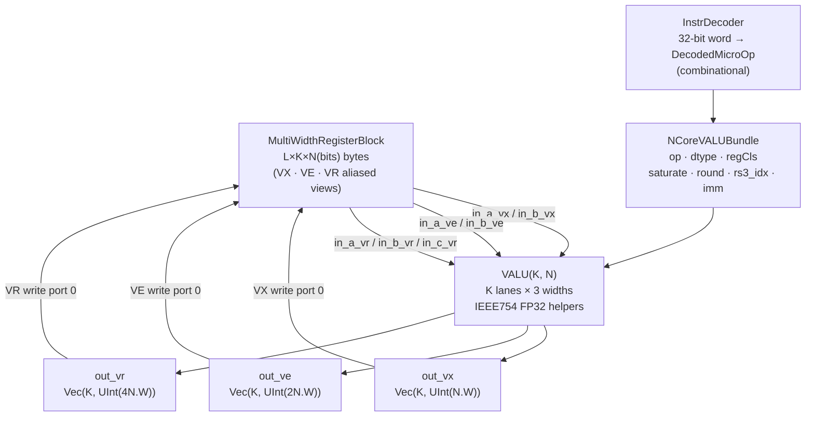
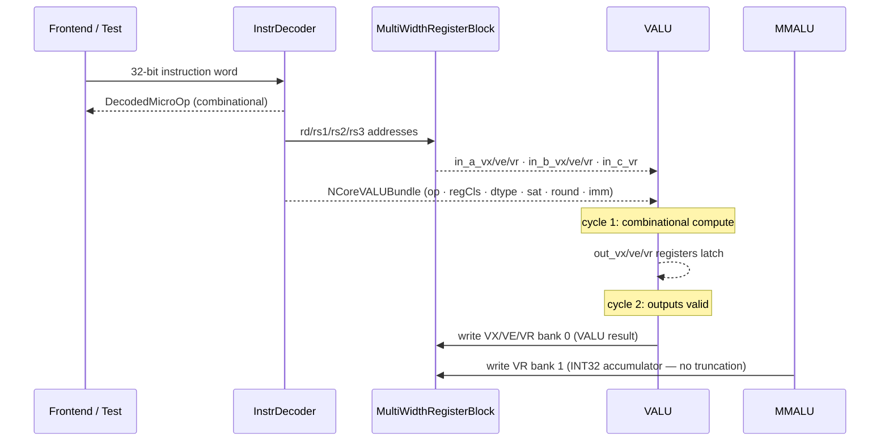
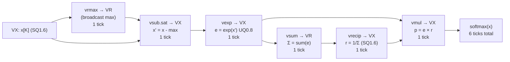
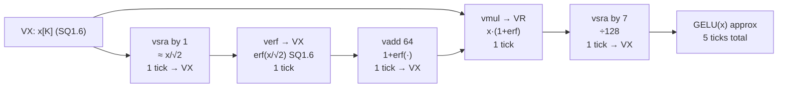

# Vector ALU (VALU)

[TOC]

The Vector Arithmetic Logic Unit (VALU) is a **K-lane, multi-width** coprocessor running
alongside the [Systolic Array](SystolicArray.md).
It handles all post-GEMM work: elementwise arithmetic, bitwise ops, horizontal reductions,
LUT-based transcendentals, type conversions (INT/FP32/BF16/BF8), scalar broadcasts, and
FP32 fused multiply-add. All output is written back to the shared
[MultiWidthRegisterBlock](Registers.md).

---

## Notation

| Symbol | Meaning | Default (test) | Default (top) |
|:---:|:---|:---:|:---:|
| `N` (N(bits)) | Base lane width in bits (VX lane = N bits) | 8 | 8 |
| `L` | Number of base VX registers (must be div-by-4) | 32 | 32 |
| `K` | SIMD lane count per register | 8 | 64 |
| `N2` | `2×N` — VE lane width | 16 | 16 |
| `N4` | `4×N` — VR lane width | 32 | 32 |

For the full encoding rules, see [ISA](../designs/01.isa.md).

---

## Architecture Overview



Key properties:

- **K lanes** processed in parallel; all three widths (N, 2N, 4N bits) are available simultaneously.
- **1-cycle latency** for all ops except `vfma` (2 cycles) and rounding CVT ops (1–2 cycles).
- **Three output ports** registered with 1-cycle latency:
  - `out_vx` — `Vec(K, UInt(N.W))` — INT8/BF8 results; VX write bank
  - `out_ve` — `Vec(K, UInt(2N.W))` — INT16/BF16 results; VE write bank
  - `out_vr` — `Vec(K, UInt(4N.W))` — INT32/FP32 results; VR write bank (also receives MMALU accumulator directly)
- **Instruction decode** is handled externally by `InstrDecoder` before the VALU sees the control bundle.

---

## Parameters and Data Types

| Lane type | Width | Register class | Implemented |
|:---|:---:|:---:|:---:|
| INT8 / BF8 | N bits | VX | ✓ |
| INT16 | 2N bits | VE | ✓ |
| INT32 | 4N bits | VR | ✓ |
| FP32 | 4N bits | VR | ✓ (Tier-2 subset) |
| BF16 | 2N bits | VE | ✓ (truncation/padding) |
| BF8 E4M3 | N bits | VX | ✓ |
| BF8 E5M2 | N bits | VX | ✓ |
| FP16 | 2N bits | VE | — (reserved) |

### VecDType encoding (in `NCoreVALUBundle.dtype`)

| Code | Type | Notes |
|:---:|:---|:---|
| `S8C4` | INT8 × K | Primary dtype for arithmetic/logic/LUT |
| `S16C2` | INT16 × K | VE register class |
| `S32C1` | INT32 × K | VR register class |
| `FP32C1` | FP32 × K | VR; Tier-2 FP32 subset |
| `BF16C2` | BF16 × K | VE; top-16-bits of FP32 |
| `BF8E4M3` | BF8 E4M3 × K | VX; selected for CVT ops |
| `BF8E5M2` | BF8 E5M2 × K | VX; selected by `funct7[6]=1` in CVT |

---

## Instruction Reference

### VALU_ARITH — Elementwise arithmetic

Opcode family `0x10`. Supports all three widths via `regCls` (from funct7[1:0]).
Saturation (`funct7[4]`) clamps narrow results.

| Op | funct3 | VX | VE | VR | Saturate effect |
|:---|:---:|:---:|:---:|:---:|:---|
| `add` | 000 | ✓ | ✓ | ✓ | clamp to lane width min/max |
| `sub` | 001 | ✓ | ✓ | ✓ | clamp |
| `mul` | 010 | ✓ | ✓ | ✓ | narrow sat on `out_vx/ve`; full product on `out_vr` |
| `neg` | 011 | ✓ | ✓ | ✓ | clamp (e.g. −(−128) → 127 for INT8) |
| `abs` | 100 | ✓ | ✓ | ✓ | clamp |
| `max` | 101 | ✓ | ✓ | ✓ | — |
| `min` | 110 | ✓ | ✓ | ✓ | — |
| `rsub` | 111 | ✓ | ✓ | ✓ | clamp (rs2 − rs1) |

wavedrom (
{ signal: [
  { name: "clk",          wave: "P.......",  period: 2 },
  { name: "instr (vadd)", wave: "x=x.....",  data: ["R-type funct3=000 width=VX"], period: 2 },
  { name: "in_a_vx[i]",   wave: "x=x.....",  data: ["a"], period: 2 },
  { name: "in_b_vx[i]",   wave: "x=x.....",  data: ["b"], period: 2 },
  {},
  { name: "out_vx[i]",    wave: "xx=x....",  data: ["a+b (sat/wrap)"], period: 2 }
]}
)

---

### VALU_LOGIC — Bitwise and shift

Opcode family `0x11`. Operates on raw bit patterns; ignores `sat` and `round`.
Shift amount = low `log2(lane_width)` bits of the corresponding `in_b` lane.

| Op | funct3 | Operation |
|:---|:---:|:---|
| `sll` | 000 | logical left shift |
| `srl` | 001 | logical right shift |
| `sra` | 010 | arithmetic right shift (sign-extending) |
| `rol` | 011 | rotate left |
| `xor` | 100 | bitwise XOR |
| `not` | 101 | bitwise NOT (`in_b` unused) |
| `or`  | 110 | bitwise OR |
| `and` | 111 | bitwise AND |

wavedrom (
{ signal: [
  { name: "clk",         wave: "P.......",  period: 2 },
  { name: "instr (vsra)",wave: "x=x.....",  data: ["funct3=010 width=VX"], period: 2 },
  { name: "in_a_vx[i]",  wave: "x=x.....",  data: ["-64 (0xC0)"], period: 2 },
  { name: "in_b_vx[i]",  wave: "x=x.....",  data: ["1 (shamt)"],  period: 2 },
  {},
  { name: "out_vx[i]",   wave: "xx=x....",  data: ["-32 (SRA)"],  period: 2 }
]}
)

---

### VALU_REDUCE — Horizontal reductions

Opcode family `0x12`. Reduces all K lanes of `in_a_vx` to a scalar and **broadcasts** to
every lane of `out_vr`. The combinational tree has no additional latency for small K.

| Op | funct3 | Result | Broadcast to |
|:---|:---:|:---|:---:|
| `sum` | 000 | `Σ lane[i]` (sign-extended) | `out_vr` all K lanes |
| `rmax` | 001 | `max(lane[i])` | `out_vr` all K lanes |
| `rmin` | 010 | `min(lane[i])` | `out_vr` all K lanes |
| `rand` | 011 | `AND(lane[i])` | `out_vr` all K lanes |
| `ror`  | 100 | `OR(lane[i])` | `out_vr` all K lanes |
| `rxor` | 101 | `XOR(lane[i])` | `out_vr` all K lanes |

wavedrom (
{ signal: [
  { name: "clk",          wave: "P.......",  period: 2 },
  { name: "instr (vsum)", wave: "x=x.....",  data: ["funct3=000"], period: 2 },
  { name: "in_a_vx[0..K]",wave: "x=x.....",  data: ["a₀ a₁ … aₖ"], period: 2 },
  {},
  { name: "out_vr[0]",    wave: "xx=x....",  data: ["Σaᵢ"], period: 2 },
  { name: "out_vr[1]",    wave: "xx=x....",  data: ["Σaᵢ (broadcast)"], period: 2 },
  { name: "out_vr[K-1]",  wave: "xx=x....",  data: ["Σaᵢ"], period: 2 }
]}
)

---

### VALU_LUT — 256-entry ROM transcendentals

Opcode family `0x13`. VX lanes only. 256-entry ROMs are precomputed in Scala at elaboration
time (object `Qfmt` in `src/main/scala/alu/vec/vec.scala`).

#### Q-format

| Port | Format | Scale | Range |
|:---|:---|:---:|:---|
| `in_a_vx[i]` | SQ1.6 | 64 | [−2.0, +2.0) |
| `vexp` output | UQ0.8 stored as SInt(N) | 256 | [0, 1) — values > 127 appear negative |
| `vrecip` output | SQ1.6 | 64 | [−2.0, +2.0); x=0 → sentinel 127 |
| `vtanh` output | SQ1.6 | 64 | [−1.0, +1.0) |
| `verf` output | SQ1.6 | 64 | [−1.0, +1.0) |

!!! warning "vexp sign interpretation"
    `vexp` output is UQ0.8 **stored as a signed byte** in `out_vx`. Values > 127
    (e.g., `exp(0) ≈ 1.0 → 255 → −1` as SInt) appear negative. Downstream arithmetic
    should reinterpret: `if (v < 0) v + 256 else v`.

| funct3 | Mnemonic | Input | Output | Accuracy |
|:---:|:---|:---|:---|:---|
| 000 | `exp` | SQ1.6 | UQ0.8 (signed byte) | ~2 ULP |
| 001 | `recip` | SQ1.6 | SQ1.6 | ~2 ULP |
| 010 | `tanh` | SQ1.6 | SQ1.6 | ~1 ULP; monotone |
| 011 | `erf` | SQ1.6 | SQ1.6 | ~1 ULP; odd function |

---

### VALU_CVT — Type conversion

Opcode family `0x14`. `funct3` = destination format code; `funct7[2:0]` = source format code.
Decoder asserts `illegal` if src == dst.

| Mnemonic | Src | Dst | Input port | Output port | Ticks |
|:---|:---:|:---:|:---:|:---:|:---:|
| `vcvt_s8_s32` | s32 | s8 | `in_a_vr` | `out_vx` | 1 |
| `vcvt_s32_s8` | s8 | s32 | `in_a_vx` | `out_vr` | 1 |
| `vcvt_s32_f32` | s32 | f32 | `in_a_vr` | `out_vr` | 1 |
| `vcvt_f32_s32` | f32 | s32 | `in_a_vr` | `out_vr` | 1–2 |
| `vcvt_s8_f32` | s8 | f32 | `in_a_vx` | `out_vr` | 1 |
| `vcvt_f32_s8` | f32 | s8 | `in_a_vr` | `out_vx` | 1–2 |
| `vcvt_f32_bf16` | bf16 | f32 | `in_a_ve` | `out_vr` | 1 |
| `vcvt_bf16_f32` | f32 | bf16 | `in_a_vr` | `out_ve` | 1 |
| `vcvt_f32_bf8` | bf8 | f32 | `in_a_vx` | `out_vr` | 1 |
| `vcvt_bf8_f32` | f32 | bf8 | `in_a_vr` | `out_vx` | 1 |
| `vcvt_s16_s32` | s32 | s16 | `in_a_vr` | `out_ve` | 1 |
| `vcvt_s32_s16` | s16 | s32 | `in_a_ve` | `out_vr` | 1 |

---

### VALU_BCAST — Scalar broadcast

Opcode family `0x15`. Splats a scalar to all K output lanes.
Primary use: loading quantization scale/zp into a register before `vfma`.

| funct3 | Format | Mnemonic | Operation |
|:---:|:---:|:---|:---|
| 000 | R | `bcast.reg` | `rd[i] = rs1[0]` for all K lanes; width from `regCls` |
| 001 | I | `bcast.imm` | `rd[i] = sext(imm[11:0])` for all K lanes |

wavedrom (
{ signal: [
  { name: "clk",            wave: "P.......",  period: 2 },
  { name: "instr (bcast)",  wave: "x=x.....",  data: ["funct3=000 width=VR"], period: 2 },
  { name: "in_a_vr[0]",     wave: "x=x.....",  data: ["scalar s"], period: 2 },
  { name: "in_a_vr[1..K-1]",wave: "x=x.....",  data: ["ignored"], period: 2 },
  {},
  { name: "out_vr[0]",      wave: "xx=x....",  data: ["s"], period: 2 },
  { name: "out_vr[1]",      wave: "xx=x....",  data: ["s"], period: 2 },
  { name: "out_vr[K-1]",    wave: "xx=x....",  data: ["s (broadcast)"], period: 2 }
]}
)

---

### VALU_FP — FP32 arithmetic

Opcode family `0x16`. Always operates on VR (K lanes of 32-bit FP). Width and dtype are implicit.

#### Tier-2 FP32 constraints

| Property | Behaviour |
|:---|:---|
| Rounding | RNE default; `funct7[3:2]` selects RTZ/floor/ceil |
| NaN inputs | Treated as ±0; output never NaN |
| ±Inf inputs | Treated as ±0; output saturates to max finite normal |
| Subnormals | Flushed to zero on input and output |
| Overflow | Saturates to `±0x7F7FFFFF` (max finite normal) |

| funct3 | Mnemonic | Operation | Ticks |
|:---:|:---|:---|:---:|
| 000 | `fadd` | `rd[i] = rs1[i] + rs2[i]` | 1 |
| 001 | `fsub` | `rd[i] = rs1[i] − rs2[i]` | 1 |
| 010 | `fmul` | `rd[i] = rs1[i] × rs2[i]` | 1 |
| 011 | `fneg` | `rd[i] = −rs1[i]` (sign flip) | 1 |
| 100 | `fabs` | `rd[i] = |rs1[i]|` | 1 |
| 101 | `fmax` | `rd[i] = max(rs1[i], rs2[i])` | 1 |
| 110 | `fmin` | `rd[i] = min(rs1[i], rs2[i])` | 1 |

---

### VALU_FP_FMA — Fused multiply-add (S-format, 2 ticks)

Opcode family `0x17`. S-format: rs3 at bits [31:27], round mode at bits [26:25].
Result always in VR.

$$\text{fma}: \quad rd_i = rs1_i \times rs2_i + rs3_i$$

| funct3 | Mnemonic | Operation |
|:---:|:---|:---|
| 000 | `fma` | `rd[i] =  (rs1[i] × rs2[i]) + rs3[i]` |
| 001 | `fms` | `rd[i] =  (rs1[i] × rs2[i]) − rs3[i]` |
| 010 | `nfma`| `rd[i] = −(rs1[i] × rs2[i]) + rs3[i]` |
| 011 | `nfms`| `rd[i] = −(rs1[i] × rs2[i]) − rs3[i]` |

wavedrom (
{ signal: [
  { name: "clk",           wave: "P.......",  period: 2 },
  { name: "instr (vfma)",  wave: "x=x.....",  data: ["S-type funct3=000"], period: 2 },
  { name: "in_a_vr (rs1)", wave: "x=x.....",  data: ["a"], period: 2 },
  { name: "in_b_vr (rs2)", wave: "x=x.....",  data: ["b"], period: 2 },
  { name: "in_c_vr (rs3)", wave: "x=x.....",  data: ["c"], period: 2 },
  {},
  { name: "out_vr",        wave: "xxx=x...",  data: ["a×b+c (2 ticks)"], period: 2 }
]}
)

---

### BF16 and BF8 Encoding

#### BF16 (Brain Float 16)

BF16 is the top 16 bits of an IEEE FP32 word — same sign and exponent, truncated mantissa.

```
FP32:  S EEEEEEEE MMMMMMM MMMMMMMM MMMMMMMM  (32 bits)
BF16:  S EEEEEEEE MMMMMMM                    (16 bits — top half)
```

- `vcvt_bf16_f32`: adds 16 zero bits in the low half → lossless exponent, truncated mantissa.
- `vcvt_f32_bf16`: removes the low 16 bits (RNE: adds 0x8000 before truncating).

#### BF8 — two variants

| Format | S | Exp | Man | Bias | Max value |
|:---|:---:|:---:|:---:|:---:|:---:|
| **E4M3** | 1 | 4 | 3 | 7 | ≈ 448 |
| **E5M2** | 1 | 5 | 2 | 15 | ≈ 57 344 |

Selected by `funct7[6]` in CVT instructions: `0` = E4M3 (activations), `1` = E5M2 (weights/gradients).

---

## Timing Summary

wavedrom (
{ signal: [
  { name: "clk",              wave: "P...........",  period: 2 },
  {},
  { name: "arith/logic/bcast",wave: "x=x.........",  data: ["issue"], period: 2 },
  { name: "→ out_vx/vr",     wave: "xx=x........",  data: ["1-tick result"], period: 2 },
  {},
  { name: "vfma",             wave: "x.=x........",  data: ["issue"], period: 2 },
  { name: "→ out_vr",        wave: "x...=x......",  data: ["2-tick result"], period: 2 },
  {},
  { name: "reduce (vsum)",    wave: "x....=x.....",  data: ["issue"], period: 2 },
  { name: "→ out_vr bcast",  wave: "x.....=x....",  data: ["broadcast Σ"], period: 2 },
  {},
  { name: "LUT (vexp…)",      wave: "x......=x...",  data: ["issue"], period: 2 },
  { name: "→ out_vx",        wave: "x.......=x..",  data: ["LUT result"], period: 2 }
]}
)

---

## Backend Integration



!!! note "Write-back timing (2-cycle hold)"
    Because VALU has a 1-cycle output register, the backend holds the decoded op active
    for **2 clock cycles**: cycle 1 latches the result, cycle 2 fires the write-back.
    A production frontend can pipeline this with a 1-cycle stall or forwarding network.

!!! note "MMALU → VR direct path"
    MMALU's 4N-bit accumulator (`Vec(K, SInt(4N))`) is wired directly to VR write port 1
    in `NCoreBackend`. **No INT8 truncation occurs.** This is the path that enables
    INT32 quantization: the full accumulator is available in VR for subsequent `vcvt_f32_s32`
    and `vfma` operations.

---

## Activation Functions via Primitives

See [Quantization Pipeline](Quantization.md) for the full worked example including register allocation.

### Softmax (K lanes, SQ1.6 input)

$$\text{softmax}(x_i) = \frac{e^{x_i - \max_j x_j}}{\sum_j e^{x_j - \max_j x_j}}$$



### GELU approximation (K lanes, SQ1.6 input)

$$\text{GELU}(x) \approx 0.5 \cdot x \cdot \bigl(1 + \text{erf}(x/\sqrt{2})\bigr)$$



---

## Implementation Notes

- **LUT ROM generation**: all 256-entry tables (`Qfmt.lutExp/Recip/Tanh/Erf`) are computed at Scala elaboration time via `Seq.tabulate(256){...}`. The same tables are imported in test specs for bit-exact verification; no runtime ROM initialisation cost.
- **`vexp` UQ0.8 sign**: `out_vx` is `UInt(N.W)`, so values 0–255 are unsigned. The UQ0.8 value 255 (exp(0)≈1.0) is fully representable. Signed reinterpretation is only needed if the caller treats `out_vx` as `SInt`.
- **`regCls` field**: the register-class selector inside `NCoreVALUBundle` is named `regCls` (not `width`) to avoid a Chisel plugin naming conflict with `chisel3.Width`. Every `funct7[1:0]` decodes to `regCls` in hardware.
- **VecOp enum width**: `VecOp` values go up to `0x45` (= 69), requiring 7-bit width. If you add new entries, verify the maximum still fits in 7 bits.
- **Per-lane shift amount**: `vsll`/`vsra`/etc. use the low `log2(lane_width)` bits of the corresponding `in_b` lane, enabling heterogeneous per-lane shifts within a single instruction.
- **FP32 `fadd32` normalization**: leading-1 detection uses `PriorityEncoder(Reverse(raw(24,0)))`. The returned value is the position of the highest set bit in the reversed vector, which equals `24 − position_of_highest_bit_in_raw`. The exponent adjustment is `(24 − lzFromTop) − 23`.
